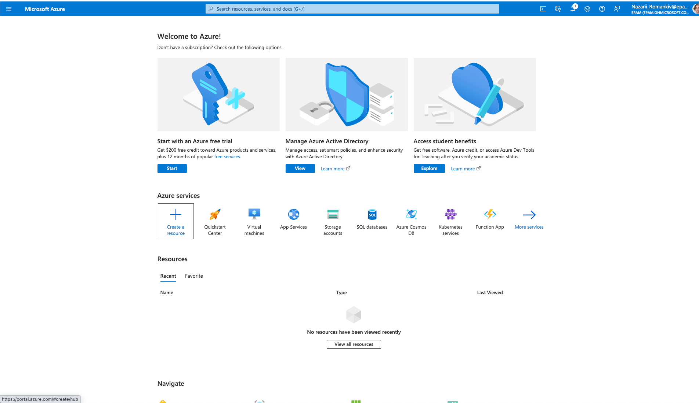
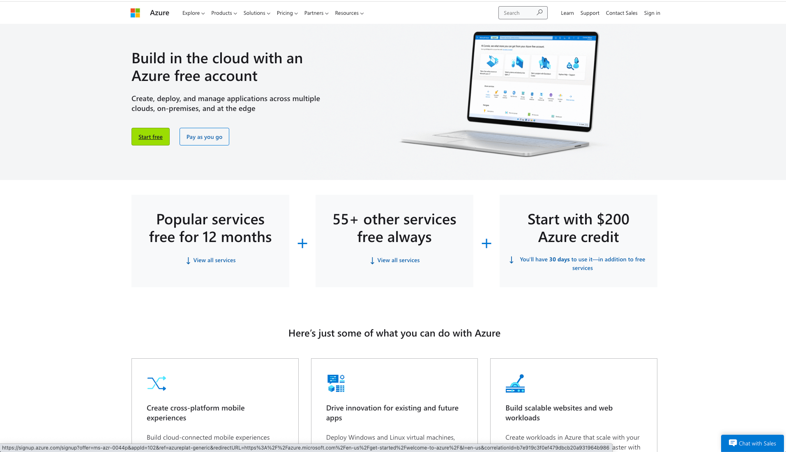
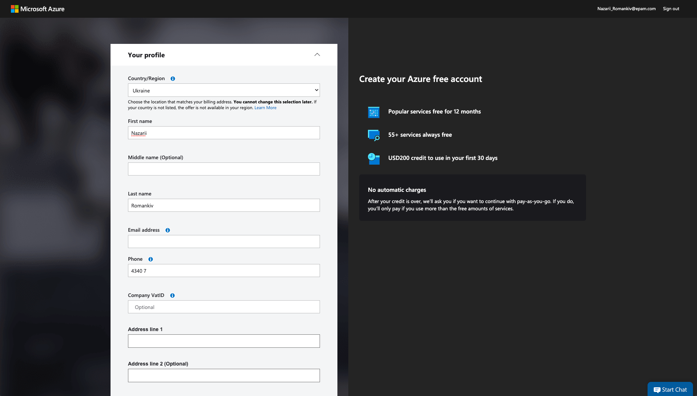
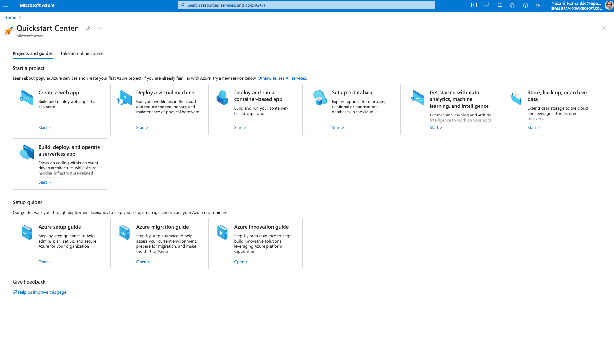

# How to create an Azure account

1. First go to [Azure Portal](https://azure.microsoft.com/en-us/) and hit the sign in button in the top right corner.
2. Use EPAM email to login.
3. When you login you should see the portal.

4. Click the blue "Start" button under "Start with an Azure free trial". (You can read more [here](https://azure.microsoft.com/en-us/free/))

5. Then click onto "Start free" button on the page.
6. It may prompt you to login, use your EPAM credentials again.
7. Fill in the information required in the form with your personal information. Enter EPAM email. Omit the VatID.

8. Hit Sign up button! Wait for the form to process your information and you should be redirected to the following page.

9. Click "Go to Azure Portal" button.

10. Congrats you have your free subscription and ready to start conquering Azure Cloud!

:::info
This is your personal free tier subscription that you can use beyound this program run, use it to
its full potential and try as many things as you want, but please keep track of your subscription limits
to not cross the free tier limits. You can find them in the [Subscriptions](https://portal.azure.com/?quickstart=true#view/Microsoft_Azure_Billing/SubscriptionsBlade) tab under your subscription panel.
Have fun!
:::
