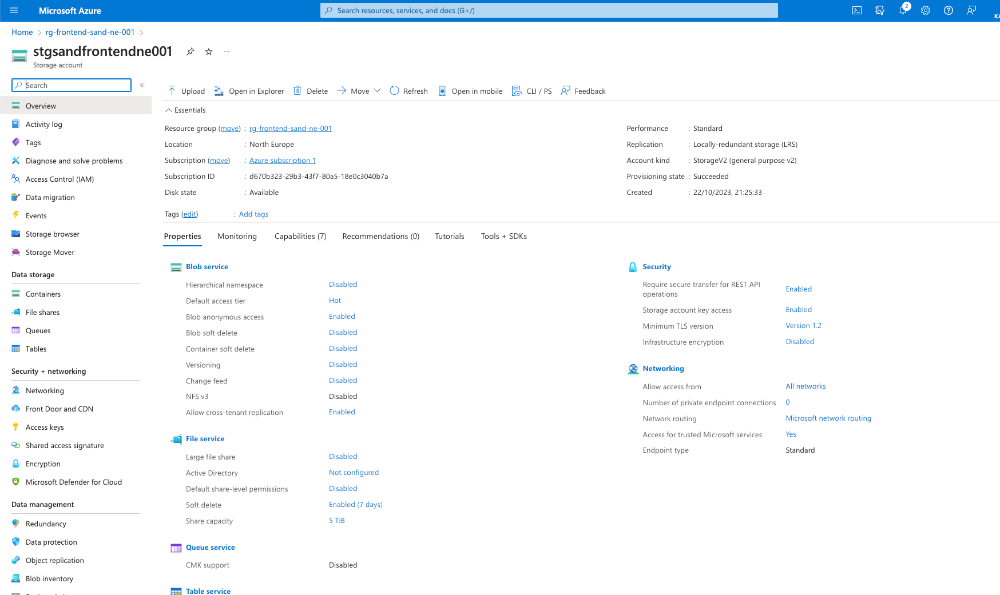

# Hosting Static Files in Azure

## Summary

Azure provides Storage Account service to store and host static files. We will utilise [Static Website Hosting](https://learn.microsoft.com/en-us/azure/storage/blobs/storage-blob-static-website) feature.

That's a super easy with Storage Account, you can follow their [step-by-step guide](https://learn.microsoft.com/en-us/azure/storage/blobs/storage-blob-static-website-how-to?tabs=azure-portal) to create the Account using the UI.

To reduce the latency for your users you can integrate Storage Account with Azure CDN. Though because the Azure CDN is not part of the Azure Free Tier offering, we won't do that. You can read more on how to do that in the reading materials.

## Hosting your first site on Azure

But we will use Terraform in this course so let's create the storage account using terraform. We will use [`azurerm_storage_account`](https://registry.terraform.io/providers/hashicorp/azurerm/latest/docs/resources/storage_account) resource.

:::info
Storage accounts in Azure have a very specific naming requirements, read more at https://learn.microsoft.com/en-us/azure/storage/common/storage-account-overview#storage-account-name
Moreover the storage account must be unique!
:::

```terraform
resource "azurerm_storage_account" "front_end_storage_account" {
  name                     = "stgsandfrontendne001"
  location                 = "northeurope"

  account_replication_type = "LRS"
  account_tier             = "Standard"
  account_kind             = "StorageV2"
  resource_group_name      = azurerm_resource_group.front_end_rg.name

  static_website {
    index_document = "index.html"
  }
}
```

Then don't forget to run `terraform apply`!

Now you should be able to see the storage account created in Azure!



## Deploying SPA to Storage Account

Now it is time to deploy your FE application to the storage account. For that build it locally and push the local files with the Azure CLI.

Example of the CLI.

```shell
az storage blob upload-batch -s './dist' -d '$web' --account-name 'stgsandfrontendne001'
```

Now if you go to the primary endpoint of your storage account you should see the SPA up and running!


**Congrats!**
