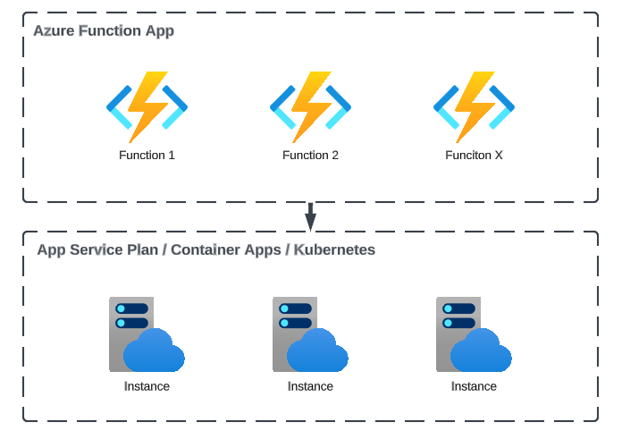

# Azure Functions

> *Azure Functions is a serverless solution that allows you to write less code, maintain less infrastructure, and save on costs. Instead of worrying about deploying and maintaining servers, the cloud infrastructure provides all the up-to-date resources needed to keep your applications running.*

In Azure architecture, the Azure Functions are hosted as Function Apps that hold multiple functions together as one unit.

In this program we will be working with `Consumption` plan of azure that provides traditional pay as you go pricing. 
While using Consumption plan you do not need to think about provisioning of infrastructure and managing it.

Though Azure also provides capabilities to run functions on Premium Plan or Dedicated Plan, as well as run them on Azure Container Apps or Kubernetes (Beta).

You should use Premium Plan if you need features that are available only in Premium, e.g. VNET Connectivity, always ready instances (to avoid cold start), longer run duration (functions that execute longer than 10 minutes). \
Therefore for most production workloads you would want to use Premium plan.

Also, peculiar detail that Azure Function App allows you to run different OS machines, e.g. Linux or Windows.
Although running Windows machines is more expensive, we recommend to run Windows machines because they have more instances (100 max vs 30 max on Linux) available and have better support.

## Event Driven Architecture

Azure Functions as any other Function as a Service solution built as Event Driven service.
The Azure Functions are configured with [triggers](https://learn.microsoft.com/en-us/azure/azure-functions/functions-triggers-bindings?tabs=isolated-process%2Cpython-v2&pivots=programming-language-typescript) and bindings to react to different events e.g. a event from queue or HTTP call. 
