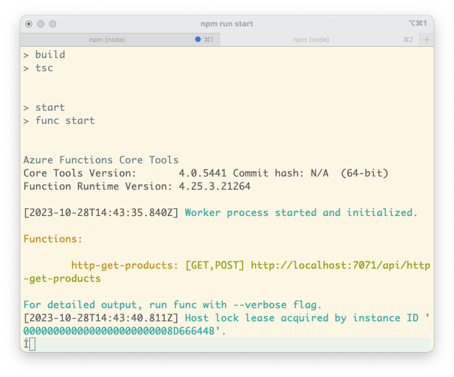
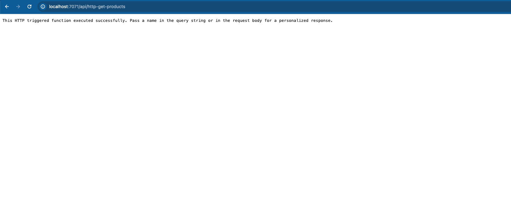
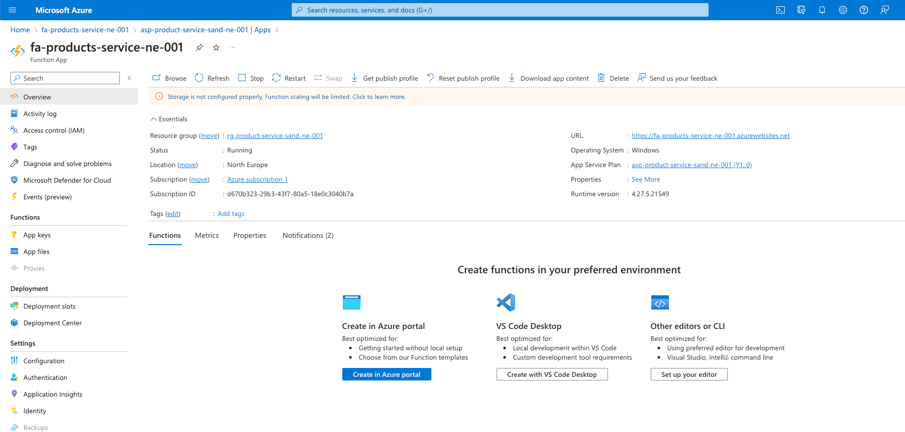
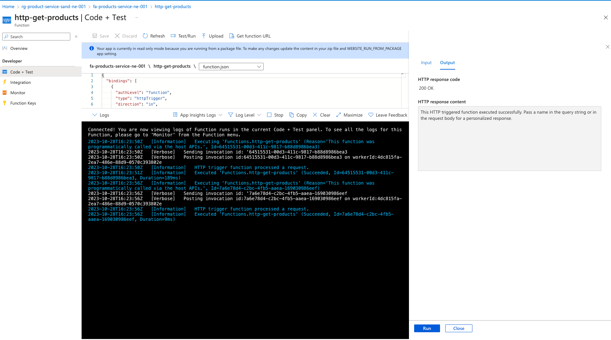
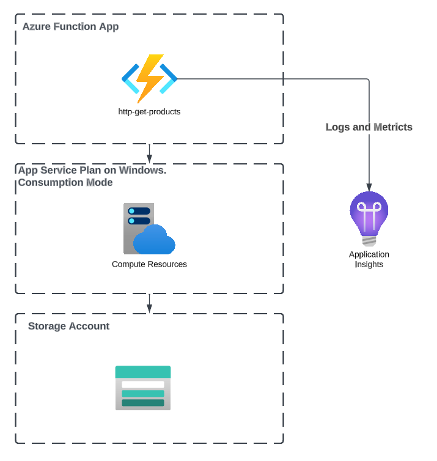

# Working with Azure Functions

:::info
In this module, we will be using the 4th (latest version at the time of the course release) version of the Azure Functions Core Tools package.
Though we will still use v3 programming model, because v4 is still raw and in preview.
We will also be using the VS Code text editor. 
:::

## Setting up local environment

1.  [Azure Core Tools](https://learn.microsoft.com/en-us/azure/azure-functions/functions-run-local?tabs=v4%2Cwindows%2Cts%2Cportal%2Cbash#install-the-azure-functions-core-tools) to run Azure Functions locally, as well as the [Azure CLI](https://learn.microsoft.com/en-us/cli/azure/install-azure-cli) to deploy the created functions to the Azure server. We can install Azure core tools with NPM running `npm i -g azure-functions-core-tools@4 --unsafe-perm true`.
2. No you can create a project with the following command `func init fa-products-service --worker-runtime typescript --model V3` command.
In the newly created project, you can see several specific files that are unique to Azure Function App, which we will discuss in a little more detail:
- `host.json` - The host.json file contains basic metadata of the project - configuration options that affect all functions in a function app instance.
- `local.settings.json` - This file stores project settings for local development, including important and confidential project data such as passwords, connection strings, and so on. For example, to work with other Azure or third-party services, we often need to integrate with them and their credentials are likely to be contained in this file. It is important to note that since local.settings.json contains sensitive and confidential information, it should only exist locally and under no circumstances should it be deployed to any server or repository.
- `.funcignore` - This file is similar to `.gitignore` for Azure - it contains a list of files and directories that should not be deployed to the Azure server.
- `.vscode\extensions.json` - This file configures VSCode settings for the Azure project. It is useful if we are working with the project through this text editor.

## Creating first function

To create a new function, run command `func new --template "Http Trigger" --name http-get-products`, to create an HTTP Triggered function.
After the process is successfully completed, you will notice that a new folder with your function has appeared at the root of the project.
Let's take a closer look at its contents.

Inside the folder with the function, there are 2 files - `index.ts` and `function.json`. `index.ts` contains the body of the template.
The function takes 2 values as parameters: `context` and `req`. The `req` will contain parameters in the form of `GET` or `POST` data from outside, and in the context,
we will write values (including technical data such as headers and contentType) that the function should return after executing its business logic.

:::warning
You **must** use `context.log` for logging in Azure Functions.
:::

```typescript
import { AzureFunction, Context, HttpRequest } from "@azure/functions"

const httpTrigger: AzureFunction = async function (context: Context, req: HttpRequest): Promise<void> {
    context.log('HTTP trigger function processed a request.');
    const name = (req.query.name || (req.body && req.body.name));
    const responseMessage = name
        ? "Hello, " + name + ". This HTTP triggered function executed successfully."
        : "This HTTP triggered function executed successfully. Pass a name in the query string or in the request body for a personalized response.";

    context.res = {
        // status: 200, /* Defaults to 200 */
        body: responseMessage
    };

};

export default httpTrigger;
```

Now let's test that our app is working! For that run `npm run start` and you will be prompted with the functions available in your app.




Testing this functions is very easy - simply call them using the provided local addresses by entering them into the browser's address bar or using Postman, passing the necessary GET or POST parameters, and making sure that the corresponding response is returned.



### Tips while working with Azure Functions Locally

How to test things

## Deploying Functions to Cloud!

Let's provision the infrastructure for out application using the terraform.

```terraform
resource "azurerm_resource_group" "product_service_rg" {
  location = "northeurope"
  name     = "rg-product-service-sand-ne-001"
}

resource "azurerm_storage_account" "products_service_fa" {
  name     = "stgsangproductsfane002"
  location = "northeurope"

  account_replication_type = "LRS"
  account_tier             = "Standard"
  account_kind             = "StorageV2"

  resource_group_name = azurerm_resource_group.product_service_rg.name
}

resource "azurerm_storage_share" "products_service_fa" {
  name  = "fa-products-service-share"
  quota = 2

  storage_account_name = azurerm_storage_account.products_service_fa.name
}

resource "azurerm_service_plan" "product_service_plan" {
  name     = "asp-product-service-sand-ne-001"
  location = "northeurope"

  os_type  = "Windows"
  sku_name = "Y1"

  resource_group_name = azurerm_resource_group.product_service_rg.name
}

resource "azurerm_application_insights" "products_service_fa" {
  name             = "appins-fa-products-service-sand-ne-001"
  application_type = "web"
  location         = "northeurope"


  resource_group_name = azurerm_resource_group.product_service_rg.name
}


resource "azurerm_windows_function_app" "products_service" {
  name     = "fa-products-service-ne-001"
  location = "northeurope"

  service_plan_id     = azurerm_service_plan.product_service_plan.id
  resource_group_name = azurerm_resource_group.product_service_rg.name

  storage_account_name       = azurerm_storage_account.products_service_fa.name
  storage_account_access_key = azurerm_storage_account.products_service_fa.primary_access_key

  functions_extension_version = "~4"
  builtin_logging_enabled     = false

  site_config {
    always_on = false

    application_insights_key               = azurerm_application_insights.products_service_fa.instrumentation_key
    application_insights_connection_string = azurerm_application_insights.products_service_fa.connection_string

    # For production systems set this to false, but consumption plan supports only 32bit workers
    use_32_bit_worker = true

    # Enable function invocations from Azure Portal.
    cors {
      allowed_origins = ["https://portal.azure.com"]
    }

    application_stack {
      node_version = "~16"
    }
  }

  app_settings = {
    WEBSITE_CONTENTAZUREFILECONNECTIONSTRING = azurerm_storage_account.products_service_fa.primary_connection_string
    WEBSITE_CONTENTSHARE                     = azurerm_storage_share.products_service_fa.name
  }

  # The app settings changes cause downtime on the Function App. e.g. with Azure Function App Slots
  # Therefore it is better to ignore those changes and manage app settings separately off the Terraform.
  lifecycle {
    ignore_changes = [
      app_settings,
      tags["hidden-link: /app-insights-instrumentation-key"],
      tags["hidden-link: /app-insights-resource-id"],
      tags["hidden-link: /app-insights-conn-string"]
    ]
  }
}
```

Now when the basic configuration is ready it is time to run `terraform apply`.
Then find your function app in Azure portal and you will see that it is empty.



----

Now let's deploy our code and run the command `func azure functionapp publish fa-products-service-ne-001`.

After a successful deployment you can go into your Azure Portal pick the function app and execute a test function!



Let's recap what we have done! First of all, we have created a Function App that runs on Consumption plan on Windows.
Also, we have created a storage account that hosts files and code of our Function App, and besides of that we have connected our Funciton App to Azure App Insights.



## How to achieve zero-downtime deployments

To achieve zero-downtime deployments you need to utilize Slots features of Azure Function App.

1. Deploy new code or config to a slot B.
2. Swap the slots.

For more read in [Azure Functions deployment slots](https://learn.microsoft.com/en-us/azure/azure-functions/functions-deployment-slots)

# Recommendations for Azure Functions

## Function Names
Follow strict naming conventions while naming your Functions, we recommend the following format:
`{trigger type}-{optional http method}-{function name}`

Examples:
- `http-get-produts` - HTTP triggered function that reacts on GET method
- `service-bus-process-products` - Service Bus (Message Broker, aka SQS) triggered function
- `cron-send-content` - CRON triggered function

## Code Organisation

Azure Functions v3 Programming Model is restricting the code organisation a bit, because you have to place your 
functions entry points in the root of your projects, but  besides of that it does not provide any requirements to the code organisation.

You could use Nest.js with an adapter to be hosted on Azure Functions, but we do not recommend since it only  supports HTTP functions, while Azure Functions has way more ways of integrations.

We recommend to utilise a minimalistic set-up with DI container, for more read in [How to use Dependency Injection in Azure Functions with Node.js](https://levelup.gitconnected.com/how-to-use-dependency-injection-in-azure-functions-with-node-js-e6a5f642ace2)

## Deployment Considerations 

- Each FA requires a Storage Account with a file-share, since storage accounts are cheap it is better to create Storage Account per FA to achieve higher levels of isolation.
- Use 64x Windows machines, since they have better support and more instances per App Service Plan on Premium instances, though come at higher price.
- For Production workloads use Premium instances. 
- Different functions can affect each other because they share physical hosts and runtime.
  Therefore, it is better to split the function app into two, one for running Async jobs e.g.
  long-running CRON jobs and service bus trigger functions, and a separate one to run HTTP triggered functions.
  This will enable you to achieve better isolation, and maintainability.
- Azure App Service Plans are meant to be shared. It is better to provision one big plan e.g.
  EP2 or EP3 and plant more different functions apps on it than provision a dozen of EP1 plans.
  Cost-efficiency and performance wise. THOUGH if you know one FA will eat up a lot of resources 
  consider moving it into separate App Service Plan.
