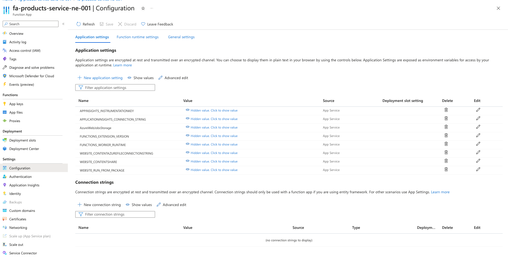
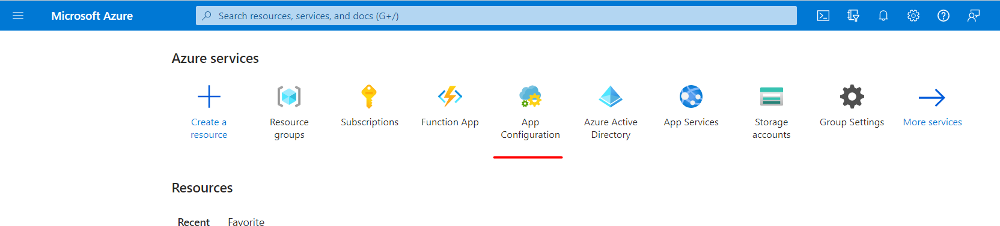
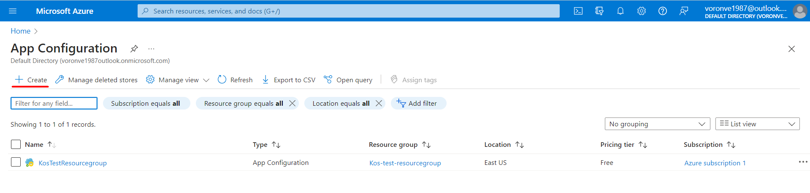
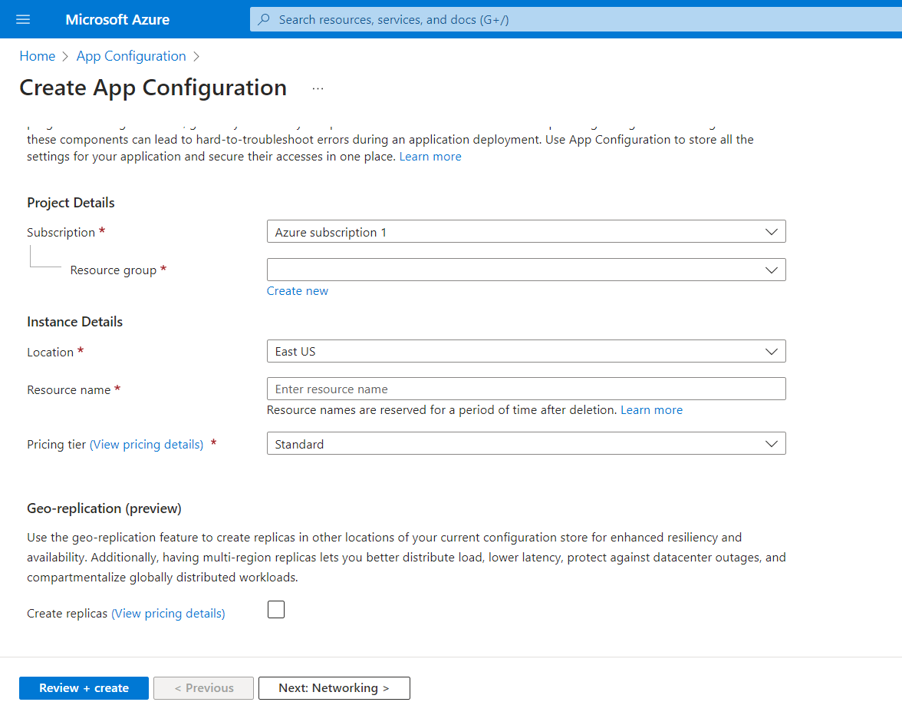
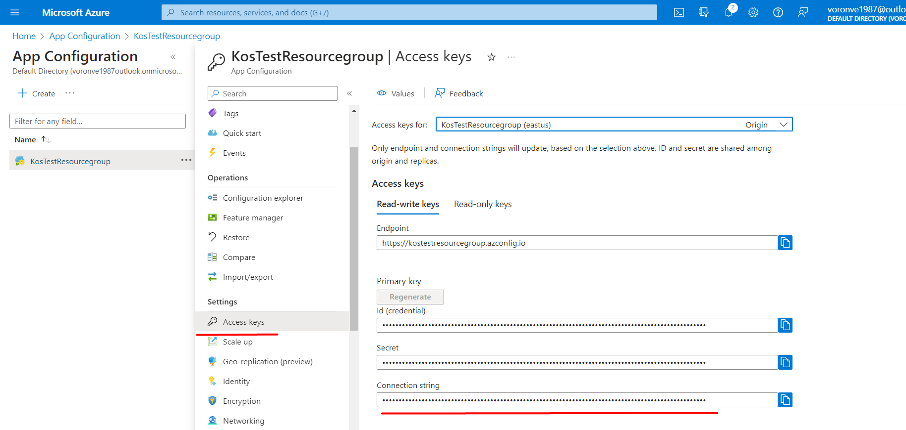

# Configuration Management with Azure Functions

There is two ways you can manage Azure Functions configuration:
- Function App Configuration - Application Settings aka Env variables
- App Config Service

Let's review them!

# Application Settings

The application settings are available in the Azure Functions resource panel
and there is a few things you need to know about them:

- Each time you update the Application Settings the application gonna restart, so be careful!
- These settings are effectively environment variables for your application.
- The Azure Function has a lot of "system" settings that you can find in documentation, like `FUNCTIONS_EXTENSION_VERSION`.
- Some settings must be presented as Application Settings, for example CRON trigger job timings.





# App Config Service

App Configuration is a tool that allows you to store all your application settings in one place.

Let's take a look at the main reasons for using this service:

1. __Centralized configuration management__. Provides a centralized location for storing and managing application configuration data, making it easier to manage and maintain configuration settings across multiple applications and environments.
2. __Dynamic configuration updates__. You can update configuration settings in real-time without needing to redeploy your application. This makes it easier to make changes to your application configuration and respond to changing business needs quickly.
3. __Version control and history__. Provides version control and history for configuration settings, allowing to track changes and roll back to previous versions if necessary. This helps ensure that configuration changes are properly tracked and audited.
4. __Feature flags and A/B testing__. It includes support for feature flags and A/B testing, allowing you to test and roll out new features to a subset of users or applications before making them available to everyone. This can help you test new features and ensure that they work as expected before rolling them out to your entire user base. 
5. __Security__. Provides secure access to configuration settings using Azure Active Directory, allowing you to control access to configuration settings and ensure that only authorized users and applications can access sensitive configuration data.

## Creating App Config Service

Let's now follow step-by step on the process of creating the App configuration service:

1. Choose the App Configuration Service from services list. 
2. Select add button in the upper left corner of toolbar. 
3. In next pane you will need to set the following settings:
    - __Subscription__ - Choose a subscription, under which your Azure functions app is registered. 
    - __Resource group__ - Select or create a resource group for your App Configuration store resource.
    - __Resource name__ - Set unique, human-like name for your App cofiguration service.  
    - __Location__ - Choose a proper service physiscal location for your location. It's a good practice to choose the same location as your other components, in our case - Azure functions. 
    - __Pricing tier__ - Select the desired pricing tier.
4. When all neccesary configurations are set, push the `Review + create` button to validate your settings. 
5. Select `Create`. The deployment process will then start. It might take a few minutes.

   :::info
    When the process will be finished, check the `Access keys` setting in `Settings` section of your newly-created service. 
    Pay attention to the `Connection string` line. This string contains all neccesary data to perform a connection with this service from other resources. You will need it later to connect to this service from your Function app.
   
   :::
6. Now, when we have App configuration service instance we could create key-value pairs there by entering `Configuration explorer` in `Operations` tab and clicking `Create` button in upper left corner of the window. As our next step let's learn how to connect to App configuration service from Azure functions.

## Using App configuration service with Azure Functions


We will only use application settings to store the connection string for connecting to the App Configuration service.

Let's start with adding app configuration connection string to the Application settings. 
1. Go to the Azure portal and copy the connection string for App Configuration following the instructions, listed above.
2. Navigate to your Azure Functions app and click on "Configuration" in the left-hand menu.
3. Under "Application settings", click on the "+ New application setting" button.
4. Enter a name for the setting (for example AZURE_APP_CONFIG_CONNECTION_STRING) and the connection string value in the "Value" field.
5. Click on "OK" to save the setting.

After deploying application to Azure portal AZURE_APP_CONFIG_CONNECTION_STRING will appear in Application settings automatically and we can get access to it through `process.env` property.

Now all we have to do is to use the connection string to connect to the App Configuration and get the variables that are stored there. To do this, we need to make some changes to the code of our target Azure function:

```ts
    import { AppConfigurationClient } from '@azure/app-configuration';

    // Create an App Config Client to interact with the service
    const connection_string = process.env.AZURE_APP_CONFIG_CONNECTION_STRING;
    import { AppConfigurationClient } from '@azure/app-configuration';
    const client = new AppConfigurationClient(connection_string);

    // Retrieve a configuration key
    const configs = await client.getConfigurationSetting({ key: 'DATA_FROM_APP_CONFIG' });
```

:::info
In example above, we were using `.getConfigurationSetting` method for retrieving single variable by it's key. In case we need to get all of the variables we should use `.listConfigurationSettings` method
:::info

In this section, we just took a quick look at App Configuration, what it is for, and what benefits we can get from using it. There are many other features that you can learn about if you are interested, such as hierarchical configuration, feature flags, versioning and history, security and access control, and more.

#### Useful meterials:
 - [Azure documentation for Azure App Configuration quick start ](https://learn.microsoft.com/en-us/azure/azure-app-configuration/quickstart-javascript)
 - [Terraform documentation for setting app configuration](https://registry.terraform.io/providers/hashicorp/azurerm/latest/docs/resources/app_configuration.html)
