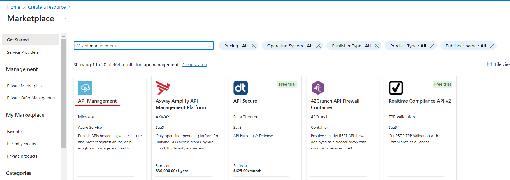
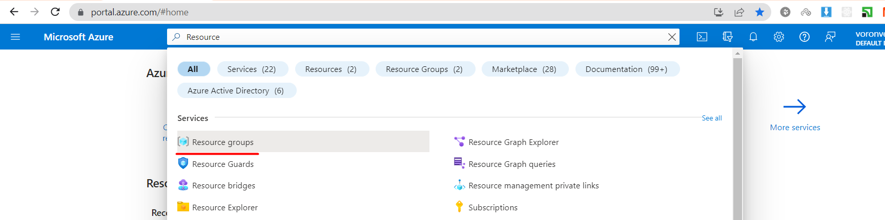
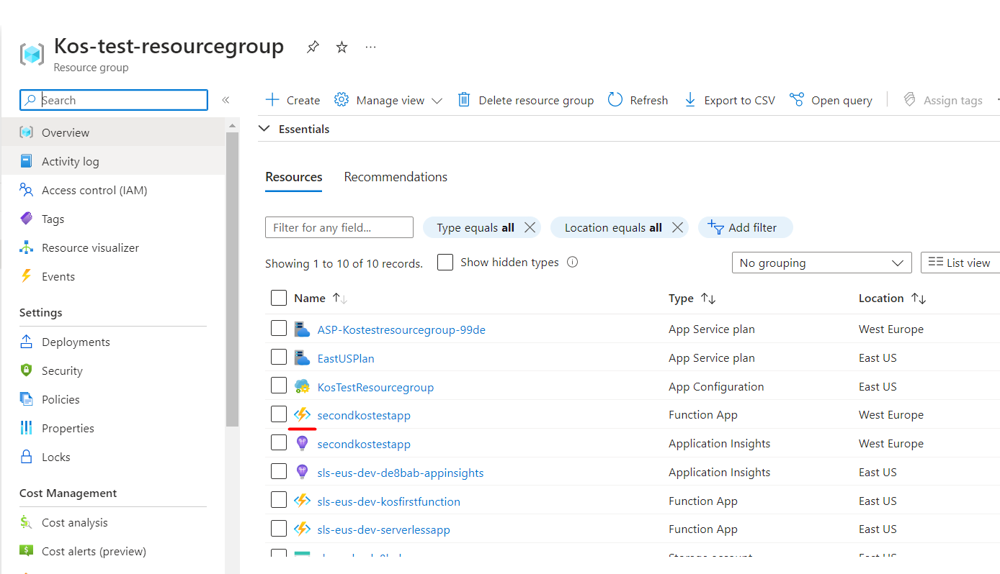
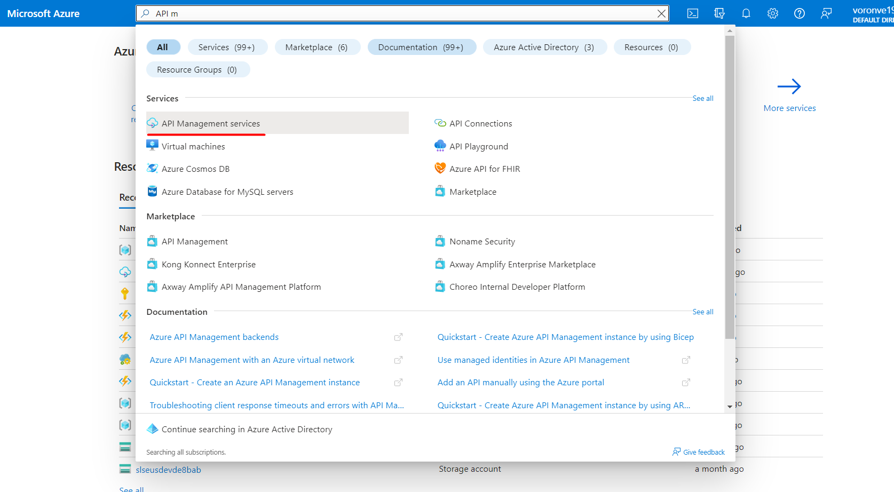
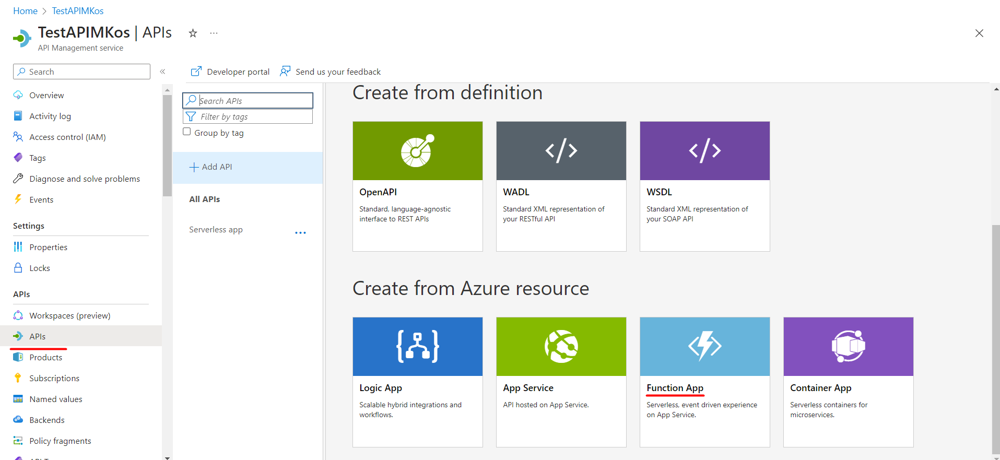
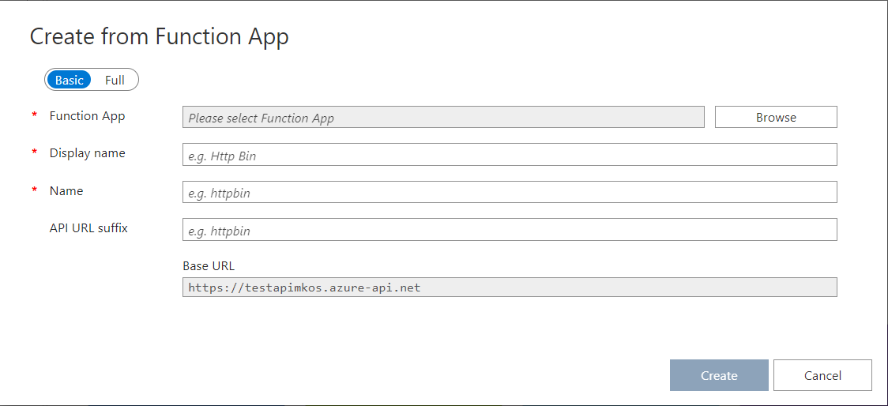
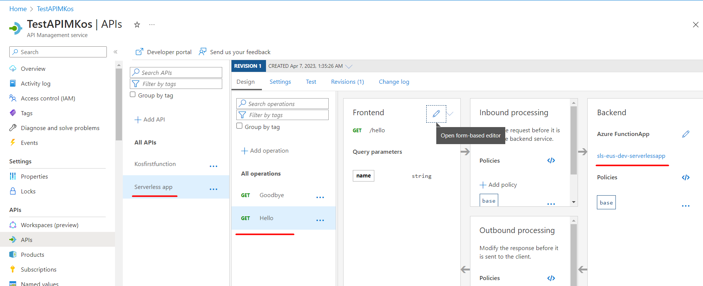
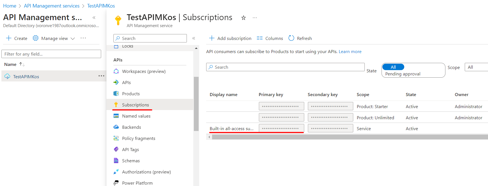
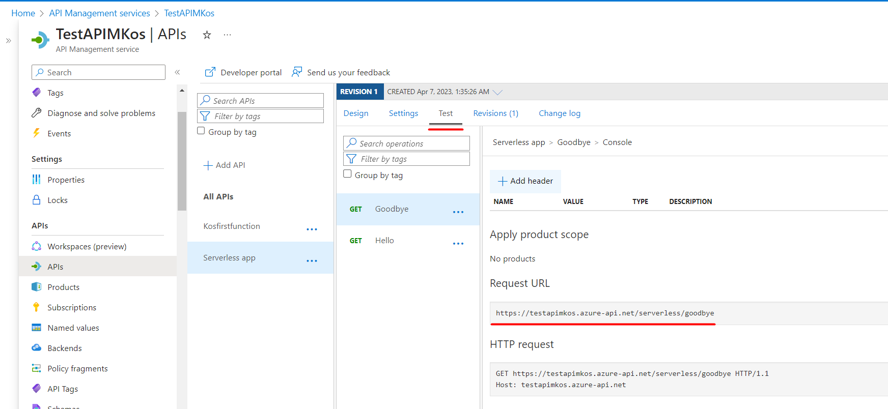

# Connecting Function app with API management

## What is API management and why do we need it

In this part of module, we will review important Azure service - API Management.

API management is a tool that helps to manage and control our APIs more effectively.
APIs (Application Programming Interfaces) are like facade to the backend services that
allow different software applications to interact and share data with each other.

API management provides a centralized platform for managing APIs, which allows organizations to:

- Create, publish and manage APIs for their own applications or for third-party developers to use.
- Control access to APIs to ensure that only authorized users can use them.
- Monitor APIs to ensure that they are performing correctly and identify any issues.
- Analyze data generated by APIs to gain insights into usage patterns and identify areas for improvement.
- Enforce security policies and apply rate limits to APIs to protect against abuse.

Overall, API management helps organizations to streamline their API development and management processes, improve security and compliance, and deliver better experiences to end-users.

The goals of this section is to learn how to:
1. _Create an instance of API Management_
2. _Connect our Azure application to API Management_
3. _Create an API that can be used to call the functionality of our application from outside_
4. _Test created API from outside of the Azure Cloud_

## The process of creation new API Management instance

Let's start with creation of the API Management instance:

1. Choose **API management** among other services on the **Create a resource** page and click `create` button: 
2. In the opened settings menu fill required fields:
- _Subscription_ - Select the subscription under which you previously created your Azure application.
- _Resource group_ - Resource group is a collection of resources that share the same lifecycle, permissions, and policies in your Azure cloud account. You can find it among other services: 
Most likely, it was created during the deployment of your Azure application to your Azure account. Choose the one with your function app: 
- _Region_ - Geographic region of the available API Management service locations. It is a good practice to choose the same region that you choose for your Azure application and other services of the same resource group.
- _Resource name_ - A unique name for your API Management service.
- _Organization name_ - The name of your organization. This name is used in many places, including the title of the developer portal and sender of notification emails.
- _Administrator email_ - The email address to which all the notifications from API Management will be sent.
- _Pricing tier_ - For the purpose of this course, select **Consumption** tier since it is part of Free tier.
3. When all the fields is filled, select `Review + create` button. It may take from 30 to 40 minutes to create and activate an API Management service.

In order to see the list of available API Management services just start inserting the name of the service in the Azure portal search panel:


## Binding Function app to API Management service:

Now let's bind the Function app you previously created to API Management.
1. Select the API Management instance you just created and pay attention to the menu on the left. We won't go into details about everything there. What we need now is the **APIs** section. This is where we will configure our API. By clicking on this section, you will enter the API settings menu. As you can see, there are many sources from which APIs can be created, but as you may have guessed, for this course, we are specifically interested in the API based on the Function app 
2. Click on `Function app` section from the possible options.
3. In the opened menu, fill all of the mandatory fields: 
- _Function app_ - Here, by clicking `Browse` button you can choose Function app (that is located in the same Resource group as APIM) as a desired source of API.
- _Display name_ - The name, that will be shown as a general name for your api.
- _Name_ - This name will be used mostly for multiple reasons, for example for creation API urls.
---
__Note:__
Pay attention to `Base URL` section. Here you can see the URL address that will be assigned to your API by default. It will be useful when we will test our API.

---
4. When all the fields will be filled, push Create button. This will create a new API, with the parameters, that were defined in your Function app.
5. When the process of creation will be compleated, you will see the new API in the list of available APIs. Clicking on it will take you to the panel of the created API, which lists the operations available for this API. These operations, as you may have guessed, are taken directly from the functions included in the Function app. If you navigate to one of these operations, in the 'Backend' section, you will see that the source of this API is exactly the Function app you selected: 

In general, that's it - we've attached our Function app to API Management and created an API based on it. Among the tabs on the API panel, you will see the `Test` tab, where you can test the functionality of your API. However, to demonstrate this more clearly, let's try to do it through an external service for creating API requests, such as Postman.

## Testing API Management service:
1. In order to test the API Management service externally, we will need the **Primary key** of this service. This key can be found in the `Subscriptions` section. Copy the `Primary key` field with the value of the Display name field - **Built-in all-access subscription**. 
2. This field should be inserted into the headers of the request in Postman. Use the header name Ocp-Apim-Subscription-Key.
3. To get the URL of the required endpoint, you can go to the Test tab of your API. 
4. The final step is to insert the url address and header into Postman or any other API requests service and run the request. Good luck!

In this module, we only covered the most basic functionality of the API Management service to help you understand why it is so essential for working with a Function app.

## Deployment Considerations for API Management

APIM should be treated as a shared resource since one APIM instance can be used to expose multiple APIs.

Besides of that, you can also route the traffic to the third parties through the APIM, in that way
you can achieve great level of observability over performances of third party APIs. e.g. you need to
call a CMS API, you can create an API that has points to the API host.

### Terraform Examples

#### Creating API Management
```terraform
resource "azurerm_api_management" "core_apim" {
  location        = "northeurope"
  name            = "apim-sand-ne-001"
  publisher_email = "nazarii_romankiv@epam.com"
  publisher_name  = "Nazarii Romankiv"

  resource_group_name = azurerm_resource_group.apim.name
  sku_name            = "Consumption_0"
}
```

#### Creating API
```terraform
resource "azurerm_api_management_api" "products_api" {
  api_management_name = azurerm_api_management.core_apim.name
  name                = "products-service-api"
  resource_group_name = azurerm_resource_group.apim.name
  revision            = "1"

  display_name = "Products Service API"

  protocols = ["https"]
}
```

#### Creating Backend
```terraform
data "azurerm_function_app_host_keys" "products_keys" {
  name = azurerm_windows_function_app.products_service.name
  resource_group_name = azurerm_resource_group.product_service_rg.name
}

resource "azurerm_api_management_backend" "products_fa" {
  name = "products-service-backend"
  resource_group_name = azurerm_resource_group.apim.name
  api_management_name = azurerm_api_management.core_apim.name
  protocol = "http"
  url = "https://${azurerm_windows_function_app.products_service.name}.azurewebsites.net/api"
  description = "Products API"

  credentials {
    certificate = []
    query = {}

    header = {
      "x-functions-key" = data.azurerm_function_app_host_keys.products_keys.default_function_key
    }
  }
}
```

#### Creating API Operation

```terraform
resource "azurerm_api_management_api_operation" "get_products" {
  api_management_name = azurerm_api_management.core_apim.name
  api_name            = azurerm_api_management_api.products_api.name
  display_name        = "Get Products"
  method              = "GET"
  operation_id        = "get-products"
  resource_group_name = azurerm_resource_group.apim.name
  url_template        = "/products"
}
```
