# How to create Cosmos DB Account

Cosmos BD Account allows you to group multiple database instances together.

1. From the Azure portal menu or the Home page, select Create a resource.
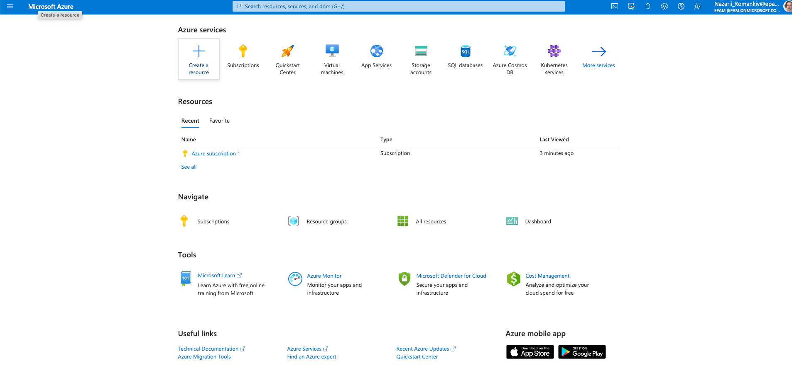
2. Search for Azure Cosmos DB. Select Create > Azure Cosmos DB.
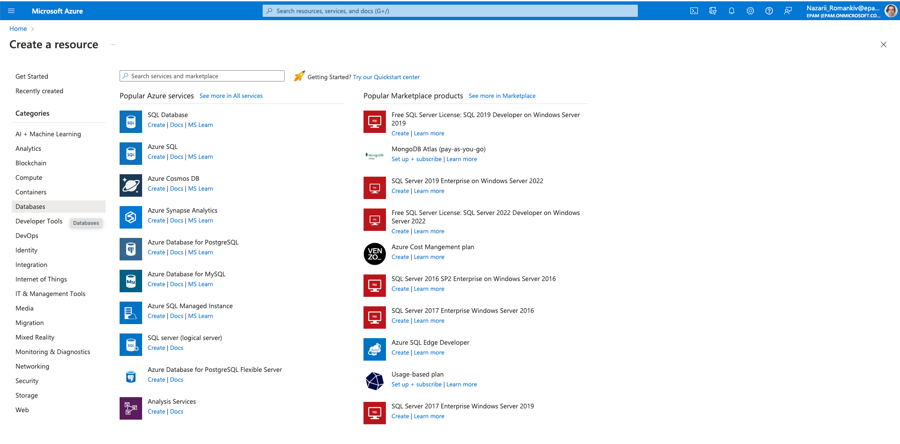
3. On the Create an Azure Cosmos DB account page, select the Create option within the Azure Cosmos DB for NoSQL section.
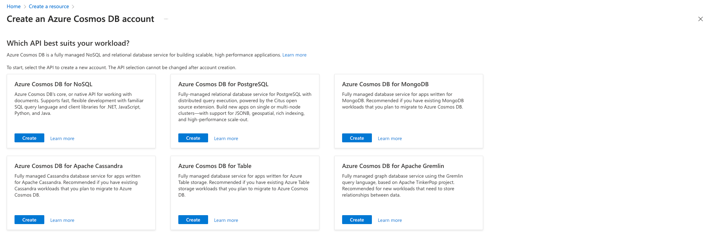
4. Pick an existing resource group for your database or create new one; Enter the account name, location and pick Serverless capacity mode.
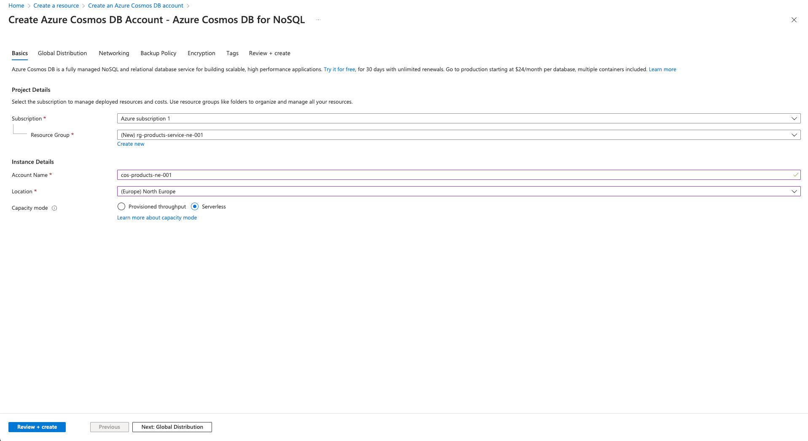
5. Hit Review + Create
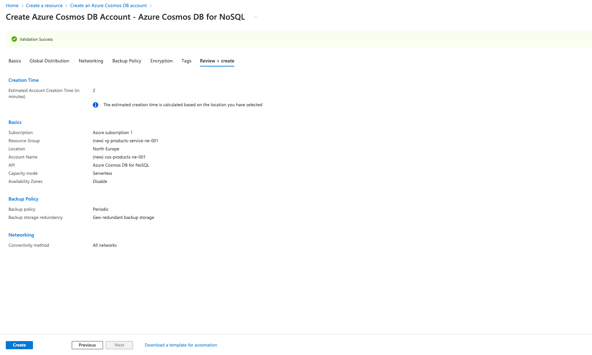
6. Hit Create button and wait for the resources to be provisioned
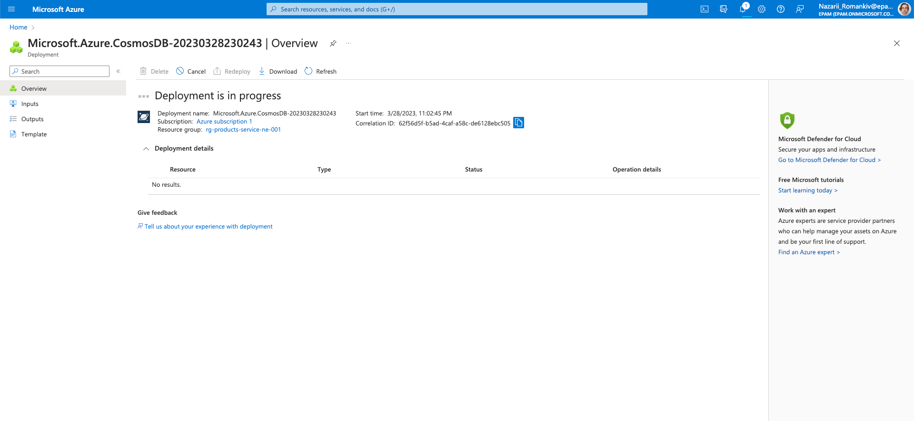
7. Wait until the deployment is complete
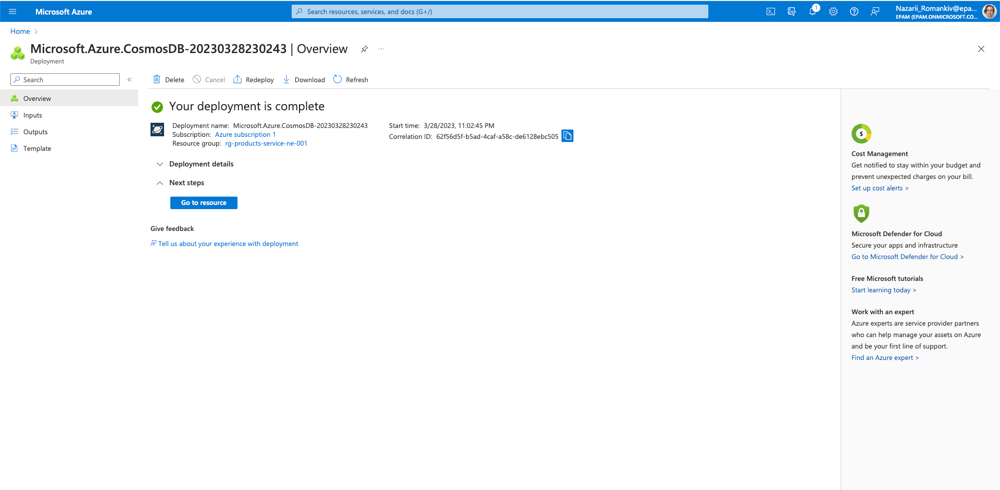
8. Click Go to resource
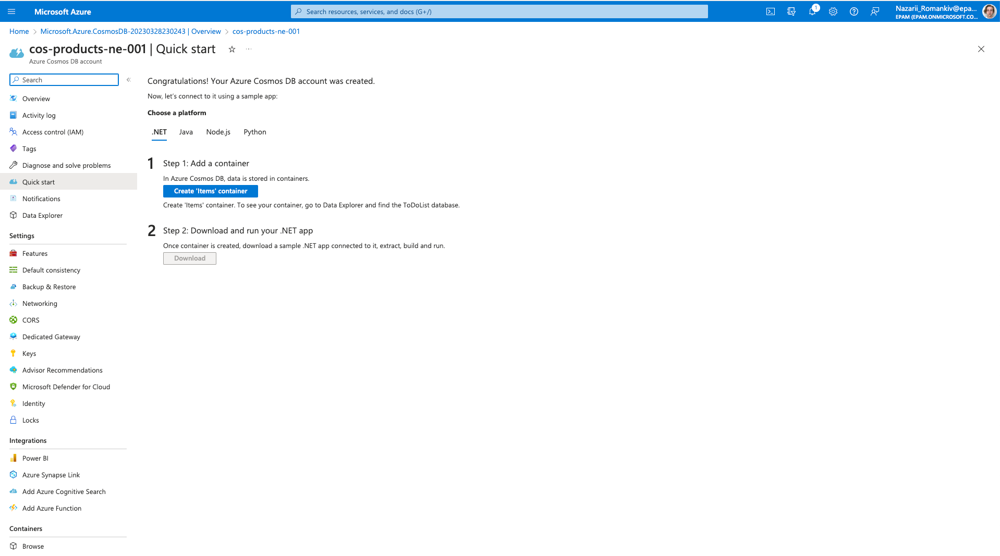
9. And now you have your own database instance!

# How to create a container in the database

In Cosmos DB records are stored inside containers (not a docker container), so let's create one and playaround with it.

1. Hit "Add Container" button on the database screen
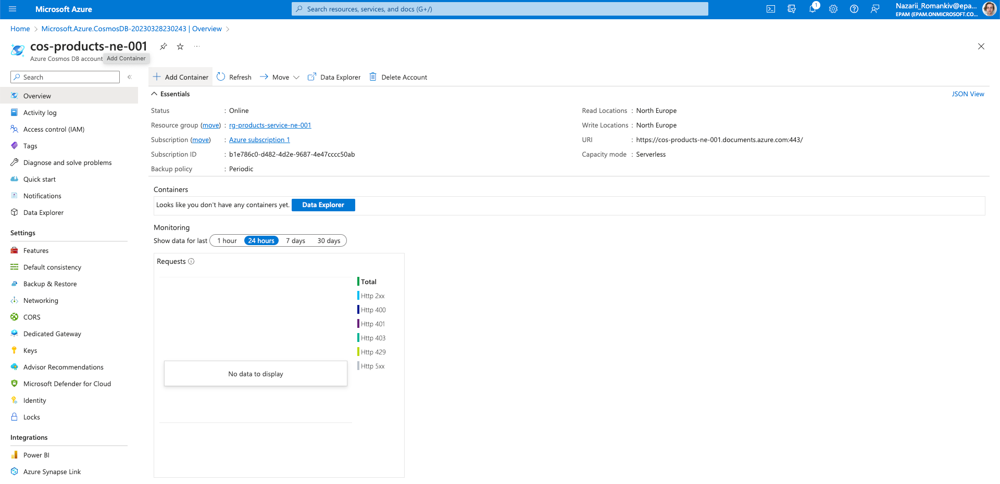
2. Fill in the required fields. 
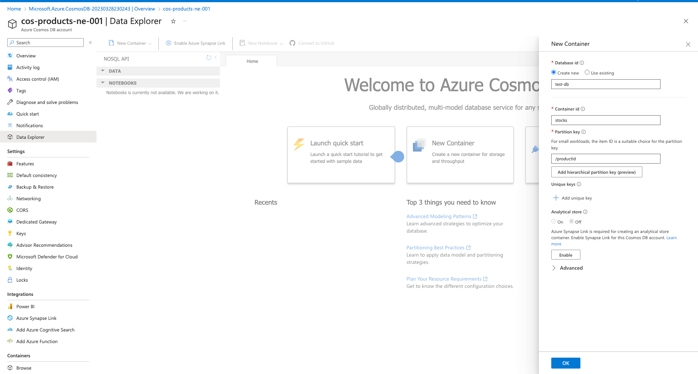
3. Hit "Ok" button, wait for it to create a database and collection for you.
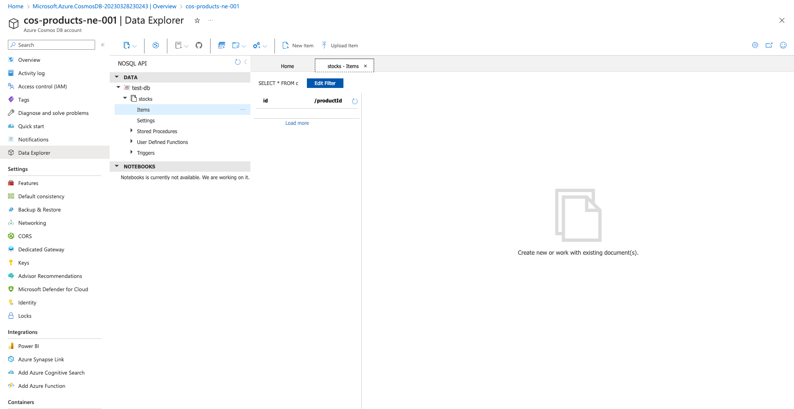
4. And now you have your very first Cosmos DB container!

Let's play around with the data in the next section!
