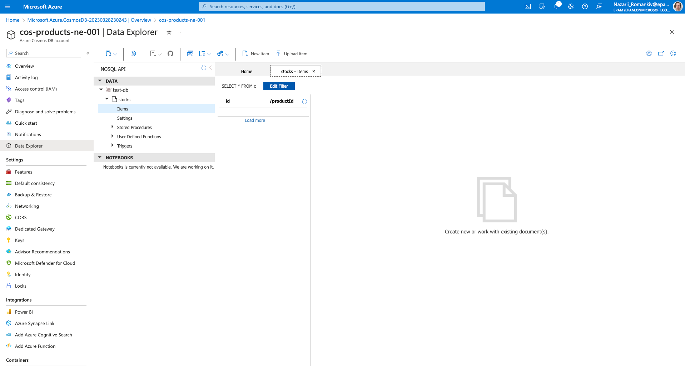
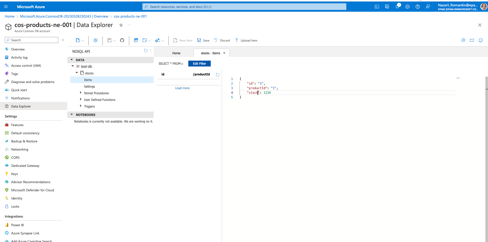
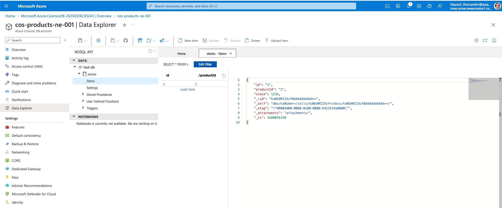
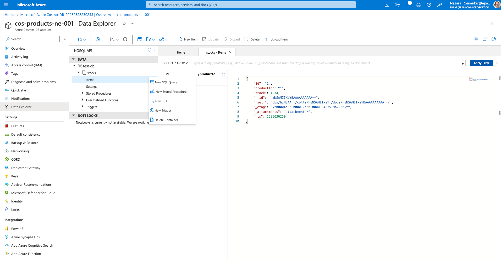
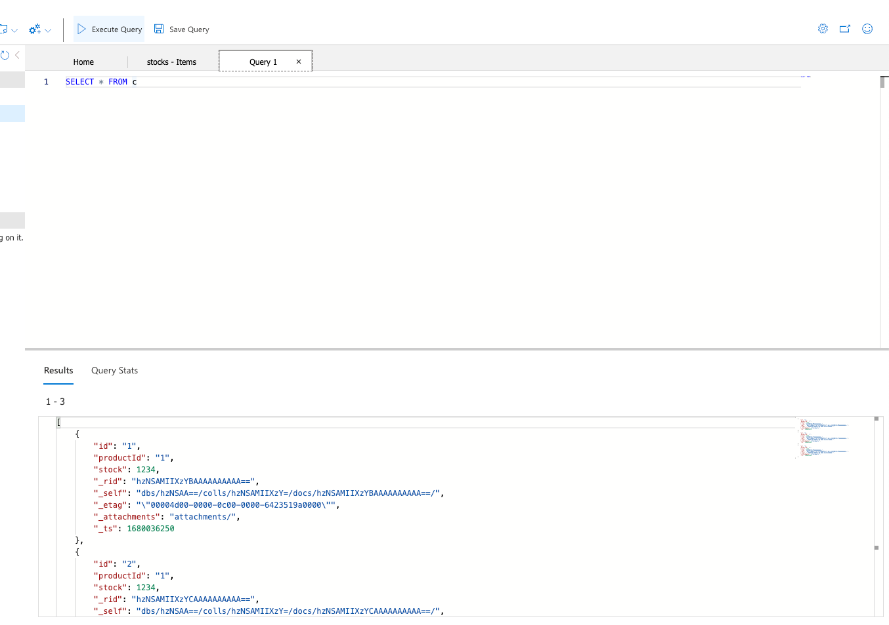
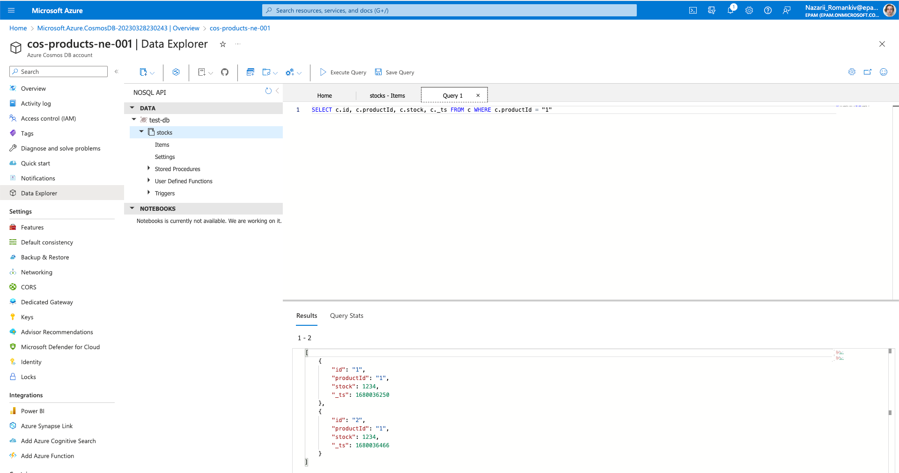

# How to create records in Cosmos DB

1. Open the items panel under the container we created

2. Click New Item button and fill in the JSON data you want. Partition key is always a string.

3. Click Save

4. And now you have your first Cosmos DB record. The Cosmos added special fields, like `_ts` and `_rig` etc.

# How to query records in Cosmos DB

1. Click onto tree dots in the Items menu item, and then click "New SQL Query"

2. The query selects records from current container, so letter `c` relates to the container we have. Let's execute the default query and see what we have.

3. Now let's modify the query to filter by a `productId`, and select a few fields.

4. As you can see the SQL API looks really similar to RDB one, but it's a lot of nuances so don't get tricked by it! 

Though the SQL API seems really convenient please keep in mind that CosmosDB logically partitions your data using the 
partition key, so the most efficient queries are one that utilise the partition key.

Let's see how we can integrate Cosmos DB with Function App in the next section!
