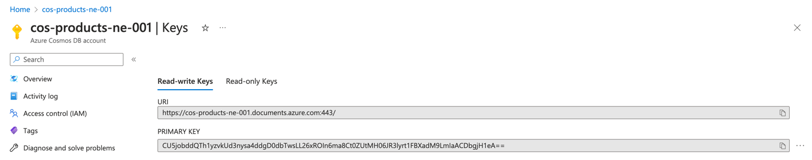
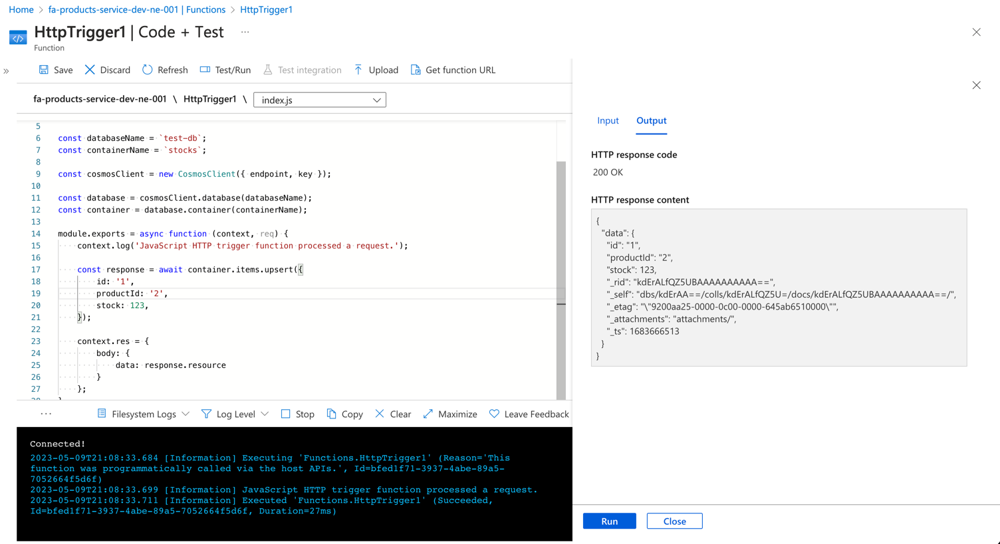
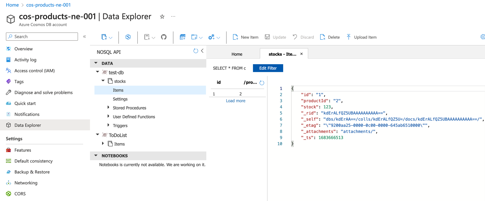

# Integration with Function App

Integration with Function App can be done in two different ways:
1. Using a [trigger](https://learn.microsoft.com/en-us/azure/azure-functions/functions-create-cosmos-db-triggered-function), that will invoke the function when something happens in the CosmosDB;
2. Using an SDK to get programmatic access to the database;

## Integration with SDK

To integrate with SDK you can either use a connection string that include credentials needed to connect to your database.
Or you can use managed identity, so that you don't need to handle credentials and all access will be managed via RBAC.
See this [article](https://learn.microsoft.com/en-us/azure/cosmos-db/nosql/quickstart-nodejs?tabs=azure-portal%2Cpasswordless%2Clinux%2Csign-in-azure-cli#authenticate-the-client) for more details.

We will show here how to access DB using connection string as it is the easies way to show how to work with the database.

1. You will need `@azure/cosmos` NPM package;
2. Then we will need a code snipped that creates a new record in the DB;
```ts
import { CosmosClient } from "@azure/cosmos";

const key = process.env.COSMOS_KEY;
const endpoint = process.env.COSMOS_ENDPOINT;

const databaseName = `test-db`;
const containerName = `stocks`;

const cosmosClient = new CosmosClient({ endpoint, key });

const database = cosmosClient.database(databaseName);
const container = database.container(containerName);

module.exports = async function (context, req) {
    context.log('JavaScript HTTP trigger function processed a request.');

    const response = await container.items.upsert({
        id: '1',
        productId: '2',
        stock: 123,
    });

    context.res = {
        body: {
            data: response.resource
        }
    };
}
```
3. Define the config values; `COSMOS_KEY` is a primary key and `COSMOS_ENDPOINT` is an URI, available under Keys;

4. Let's test it!

5. And let's check the database.


We can see that the record was successfully created!
