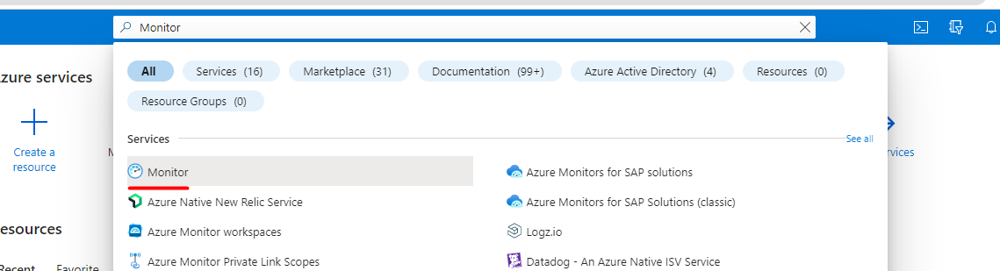

# Configuring and using logs in Azure cloud

## Importance of logging and monitoring in cloud applications

In the final part of this module we will look at one of the most important part of development process - logging and monitoring. As organizations move their applications to the cloud, it becomes increasingly important to have visibility into the performance and usage of these applications. One of the key ways to achieve this visibility is through logging and monitoring procedures. By collecting and analyzing log data, organizations can gain insights into application performance, user behavior, and potential security threats.

Azure, provides a range of logging and monitoring options that can help organizations gain these insights. In this section, we'll provide an overview of logging functionality in Azure and how it can be used to monitor and improve the performance and security of your applications.

We'll explore the different logging options available in Azure, including Azure Monitor, Azure Log Analytics and Azure Application Insights. We'll also discuss how to configure logging in Azure, how to analyze log data using tools like Kusto Query Language (KQL) and Log Analytics workspaces, and provide some best practices for logging in Azure.

## Azure Monitor

The main source of log collection in Azure is Azure Monitor. It is a powerful tool for monitoring and managing your applications and infrastructure. Azure Monitor is a cloud-based service that helps you monitor the performance and availability of your applications and infrastructure running on Azure. It collects data such as performance metrics, log data, and usage data, and provides tools to analyze and visualize this data to gain insights into the health and behavior of your systems. With Azure Monitor, you can set up alerts to notify you when specific conditions are met, such as when a performance metric exceeds a threshold or when an error occurs. This allows you to proactively identify and address issues before they become major problems.

Especially important for developers is the fact that Azure Monitor allows us to collect, configure, and display information about the execution of Azure functions. This enables us to analyze the function execution process and precisely track when, where, and why a certain event occurred, such as an error. We can also create our own logs, follow along the trace of a specific request, and do many more.

You can find Azure Monitor in the Azure portal by entering its name in the search panel: 
Clicking on the link will take you to the service, which provides access to all the data it collects. Some of the most important features of Azure Monitor include Application Insights, Logs, and Alerts. All of this data can be configured, but in this course, we will limit ourselves to a brief analysis of the data collected by Azure Monitor by default.

- Application Insights is a powerful tool for collecting and displaying many performance metrics of our applications, such as the number and time of failed requests, the total number of requests for period, server everege response time, application availability periods, and many others.
- Logs feature is an interactive tool for displaying the collected logs of any services on the screen using a special query language called Kusto Query Language (which we will come back to later).
- Alerts are a great way to track and/or inform specialists of various important events, achieving certain conditions, or encountering errors. Using this service, you can configure a wide range of metrics to track these conditions and specify the actions to be taken when they occur. For example, we can send email notifications of critical errors or exceeding the time limit set for server response.

We can get access to all of this tools not only from Monitor service directly, but also from targeted service itself. Each service sidebar contains "Monitor" section with links to appropriate part of Monitor for this particular service: 

## Tracking logs
### Logstream
The easiest way to view logs in "live" mode is Log stream. It can be opened through a corresponding link in the "Monitor" section of the service or, in case of Azure function, by opening the "Code + Test" tab in it  Log stream displays a special terminal where you can see the service execution logs, provided that it is currently active. In case of a function, we can simply test it by running it clicking the "Run" button. In the terminal, we will immediately see the live output of the logs 

### Logs
Log stream is a great tool when we need to quickly and immediately see what is happening during the execution of a function, but very often we need to be able to view what exactly was happening in a service during a specific period of time in the past. For this purpose, a tool called "Logs", which can also be found in the Monitor section of our service, is great. When we open it, we will see a menu that will offer us templates of ready-made queries to obtain a wide variety of information related to logs:  These queries are written in a special language called Kusto Query Language (KQL). This language is similar to SQL and allows us to formulate the necessary conditions for obtaining the required logs with great precision, as well as combining the values ​​of several collections similar to joins in the same SQL.

Typical KQL query looks like this:
```
AzureDiagnostics 
| where Category == "FunctionAppLogs"
| where FunctionName == "myFunctionName"
| where InvocationId == "myInvocationId"
| project TimeGenerated, FunctionInvocationId, Level, Message
| order by TimeGenerated desc
```
This query will retrieve logs for a specific Azure Function based on its name and invocation ID. It will filter for logs in the FunctionAppLogs category and return the time the log was generated, the function invocation ID, log level, and log message, sorted in descending order by the time the log was generated.

Let's try to write the simplest query to get logs for fun! First, run the function in the "Code + Test" tab so that a few logs are added to Application Insights, and then go to the logs tab in the Monitor section of your application. Close the "Queries" window, as we will write our own query from scratch. It is worth paying attention to the "Select scope" button 
This button allows you to switch between services from which we want to get logs. Logically, since we are accessing logs from a specific application, the scope by default is directed to the Application Insights section of that application. However, sometimes we may want to select the scope of the application itself (bypassing Application Insights). Sometimes this approach allows you to get more accurate and up-to-date data. However, to do this, you will need to activate logs specifically for this application in the Monitor. At the moment we'll stick to Application Insights logs.

By default, each function execution ends with a final message indicating that the function has been successfully executed. Let's write a query that would show when the function was last executed. For the sake of time and resources, we don't need all the fields that are present in the logs. Let's leave only 3 - the timestamp, the message text itself, and the "severity level" (the last field indicates how important this message is. There are 4 severity levels, where 0 is just informational messages, and 4 is a critical error that can affect the service execution). Also, let's sort the retrieved data by date.

Our request in this case will look like this:
```
traces
| where operation_Name == '<myFuncName>'
| where message contains "Executed"
| sort by timestamp desc
| project timestamp, message, severityLevel
```

---
__Note:__
The first line represents the name of the collection from whitch we are retrieving logs. "Traces" table is a table with detailed logs emitted through application code/logging frameworks.

---

After successfully executing the command in the output field, we will see the query result in the form of a table, which can be expanded for convenience: 

In this section of the module we just scratch the surface of some of the key logging concepts and services of Azure such as Azure monitor, logstream, log querying using Kusto Query Language, and visualization of log data.

#### Useful resources

- [Azure Monitor](https://learn.microsoft.com/en-us/azure/azure-monitor/overview)
- [Kusto Query Language](https://learn.microsoft.com/en-us/azure/data-explorer/kusto/query/)
- [Azure Log Analytics](https://learn.microsoft.com/en-us/azure/azure-monitor/logs/log-analytics-tutorial)
- [Azure Application Insights](https://learn.microsoft.com/en-us/azure/azure-monitor/app/app-insights-overview)