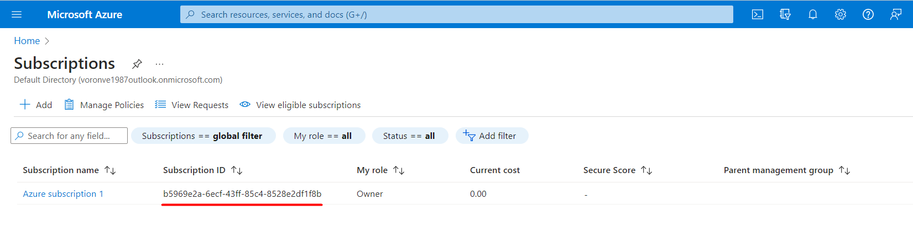

# Working with Serveless framework

Azure Functions core tools is a great set of tools for efficient and convenient work with Azure Functions. Typically, its functionality covers most needs when developing web applications. However, in some cases, especially in large projects and teams, an additional tool may be needed to effectively develop the application, which would add an additional level of abstraction and thus facilitate communication and understanding of the application's infrastructure between different developers and teams, implementing the principle of Infrastructure as Code (IaC). One popular tool for this purpose in Azure Functions is the Serverless framework.
The main advantages of this framework over Azure Functions core tools are such:
- The Serverless framework creates a single .yml file for configuring the infrastructure of our project, making it easier to navigate and understand it since we no longer need to search for information about its different elements and services in different places and configure them separately.
- This approach simplifies the process of connecting different Azure services with the business logic we write for our application.
- The single configuration file also makes it easy to share project settings among team members, without spending extra time manually configuring it each time.
- Thanks to this unified approach, the project is incredibly easy to transfer to other accounts (e.g. for testing) or even to other services.
- In the long term, an application built on this approach becomes very easy to scale, for example by adding support for more users.


## Assumptions

In this module, we will be using the 4th (latest version at the time of the course release) version of the Azure Functions Core Tools package for 64-bit Windows operating system. We will also be using the VS Code text editor.

Unfortunately, at the time of creating this course (and we believe this is the main drawback of this framework), the Serverless framework does not support Node.js versions higher than 14. Therefore, for the purpose of testing this functionality, we suggest that you will downgrade your Node.js version to 14, if your version is higher, using the version manager nvm.

Also, similarly to the previous section, we will continue to use TypeScript as the main programming language for working with this framework. 


## Process
1. Let's start with installing the Serverless framework itself. This can be done by using the command `npm install -g serverless`, which will automatically install the latest version of Serverless globally on your computer.
2. The next command will create an Azure project for us: `serverless create --template azure-nodejs-typescript --path my-service-name` (note that the official documentation uses a different command as an example, where the `--template parameter` is set to `azure-nodejs`, but since we agreed to use TypeScript, we need to use the `azure-nodejs-typescript` template). This command will automatically create a Serverless project in the folder specified in the `--path` parameter.

  Let's take a closer look at the contents of this folder. In addition to the files we are already familiar with, we can see that Serverless has automatically configured TypeScript for us - it created a `tsconfig.json` file with minimal settings and also created two test functions in TypeScript format and placed them in the `src/handlers` folder. We can also notice the configured `webpack.config.js` file, and by opening `package.json` we can see that it even added all the necessary dependencies. Pretty convenient, isn't it? But the most important element and the main feature of Serverless is, of course, the `serverless.yml` file. When we open it, we will find a lot of interesting information. First of all, these are the basic settings of the created test functions, which are located in the `functions` block. We will also find information about our provider - `provider` section, a section for environment variables - `environment`, and the name of our service - `service`.

  However, there are few other interesting sections that are specific to a project based on the azure-nodejs-typescript template and would be absent in the azure-nodejs template. Firstly, this is the plugins section. This section is intended to connect additional modules from the official plugin repository created by the Serverless community `https://github.com/serverless/plugins`. As we can see, in our case, we have installed the serverless-azure-functions plugin, which is the main plugin for working with Azure functions using Serverless, as well as the serverless-webpack plugin, which is necessary for convenient TypeScript project assembly on Serverless. Secondly, this is the custom section where Serverless placed the basic webpack settings. From everything described above, we can already see how easy and convenient it is to configure a project when all the settings are in one place!

3. Now, in your terminal, move to the folder with project and install the dependencies by typing the command `npm install` 

4. At this stage, we are ready to launch our function locally. To do this, enter the command `sls offline` in the terminal. This command will do several things - first, for each of our Azure functions, it will create a separate folder containing the configuration file `function.json`. This file, among other things, contains the address of the folder where the function files will be built (because we need files with the .js extension, not .ts, to run them). Second, this command launches Webpack, which will build JavaScript files from TypeScript and place them inside the .webpack folder (which is specified in the "functions.json" file as a path). And third, it will launch the project. As with Azure Functions Core Tools, you will see the local addresses of active functions on the console screen, which you can enter in the browser address bar or in Postman and run them locally.

5. The next logical step after testing our application locally would be to deploy it to the Azure account we created. To do this, we use the command `sls deploy`. However, before we can do that, we need to authenticate to our Azure account using the Azure CLI:

- Type `az login` in the terminal to authenticate. 
- After you've authenticated in your browser, the next command you'll need to enter is `az account set -s <subscription-id>`, where you'll need to substitute your own subscription ID instead of `subscription-id`. Finding your subscription ID is easy - on the main Microsoft Azure screen, open the Subscriptions service.  In the window that opens, you will see a list of all your subscriptions with their related id's. If you don't have a created subscription, you can create one right here, in this window. 
- The next step is to generate a service principal for your Azure subscription. This can be done using the command "az ad sp create-for-rbac --name 'my-unique-name'", where 'my-unique-name' is a name of your choice. This will yield something like:
  ```
  {
    "appId": "servicePrincipalId",
    "displayName": "name",
    "name": "name",
    "password": "password",
    "tenant": "tenantId"
  }
  ```
- After that, you need to set environment variables with values from above service principal. If you use bash, you can perform this by entering next commands:
  ```
  $ export AZURE_SUBSCRIPTION_ID=<subscriptionId>
  $ export AZURE_TENANT_ID=<tenantId>
  $ export AZURE_CLIENT_ID=<servicePrincipalId>
  $ export AZURE_CLIENT_SECRET=<password>
  ```
  ---
  __Note:__
  In the future, you will definitely want to store your configuration variables in a more reliable and permanent location. This can be achieved using the `serverless-dotenv-plugin`. This plugin allows you to use a `.env` file to store your environment variables and load them into your functions when the application is launched.

  ---
6. After successfully implementation of these steps, `sls deploy` command should successfully deploy your function app into Azure. 
  
  ---
  __Note:__
  Usually, the steps described above are enough for a successful deployment of your application to your Azure account. However, in some cases, when running the `sls deploy` command, you may encounter an error indicating that you do not have editing rights to the resource group. In such a case, you will need to create it by yourself (or use an existing one) in your Azure account (by default, you will have owner rights to it) and add its name to the serverless.yml file into _provider_ -> _resourceGroup_ section.  

  ---

In this section, we briefly covered the process of creating, editing, and deploying Azure functions using the Serverless Framework. It is a convenient tool that can greatly simplify work with a project, especially in large teams. Unfortunately, at this stage, it has its drawbacks - the lack of support for the latest versions of Node.js, not the best support for the Azure platform, and of cource, it is important to remember that any abstraction over native functionality always has certain limitations. After all, the decision of weather use this framework on your project or not should be weighed and considered.

#### Useful meterials:
 - [Serverless framework documentation for Azure](https://www.serverless.com/framework/docs/providers/azure)
 - [serverless-dotenv-plugin](https://www.serverless.com/plugins/serverless-dotenv-plugin)