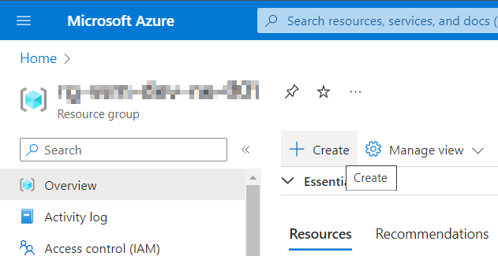
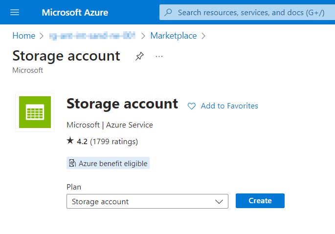
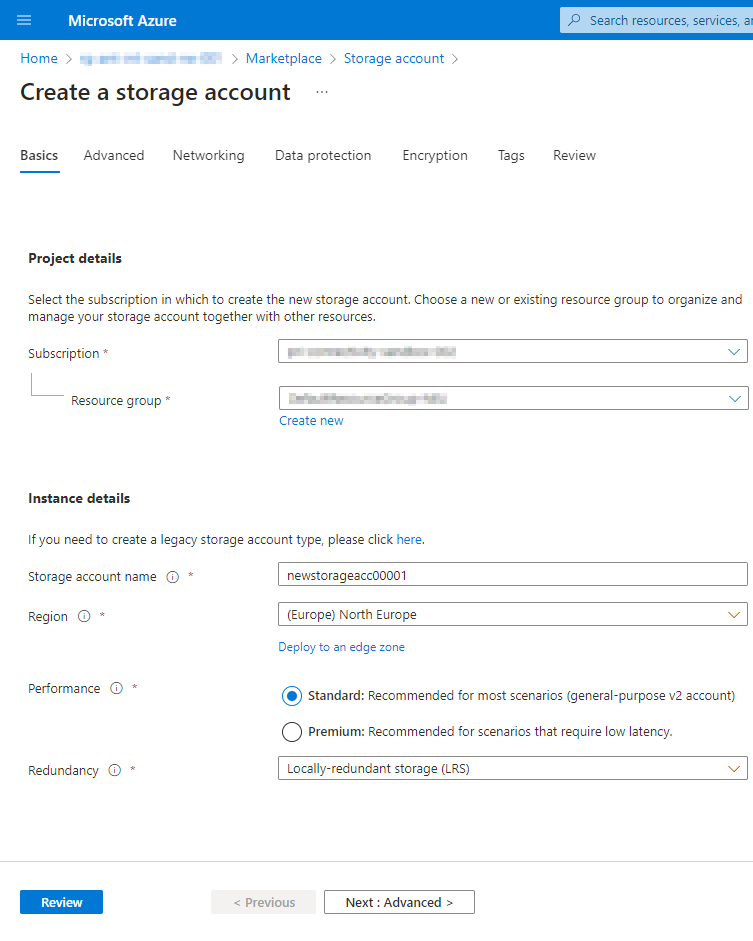
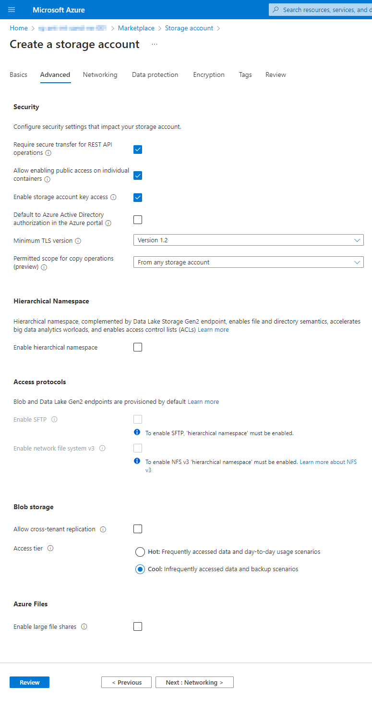
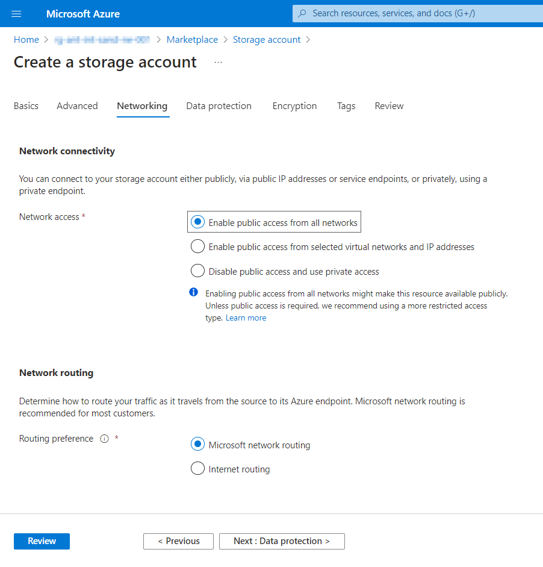
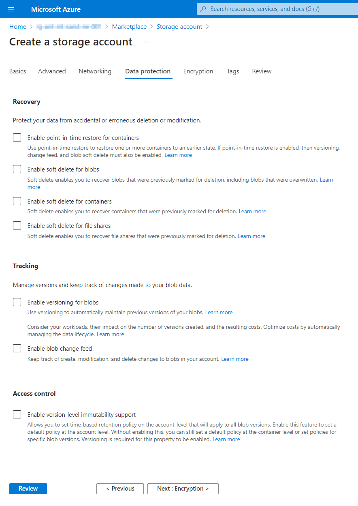
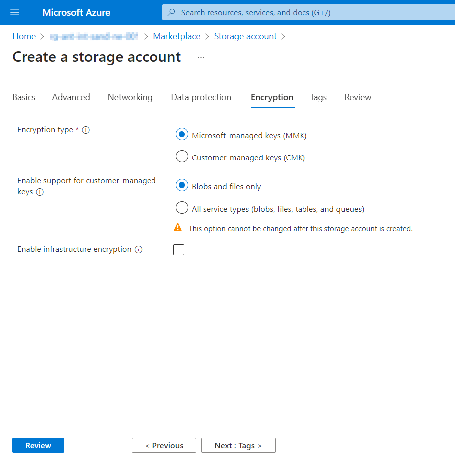
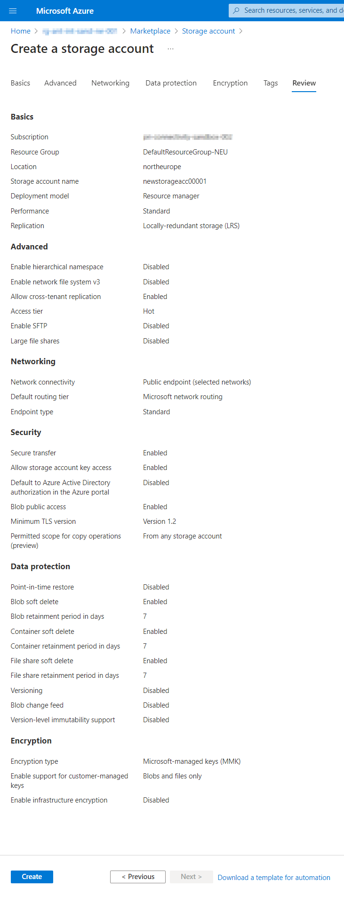

# Create Storage Account in Portal

### Use resource creation tool form any place in portal and select type: Storage Account



### Base attributes

 - Resource Group (prefilled if creation started from existing group)
 - Name (unique per tenant, alpha-numerics)
 - Region (use closest or subscription defined)
 - Redundancy (LRS is preferred for simple cases)



### Advanced attributes
Mostly those attributes can be left alone on defaults
For simple cases to decrease pricing use "cool" access-tier without cross tenant replication



### Networking, DataProtection and Encryption
Those sections also can be passed on-defaults in most cases
Use public-access for simplicity of network configuration


Most data protection attributes can be switched off to save costs if it's not a production environment


If you are not planning to use external encryption key generation, use default options


### Review
Show all previously selected options and attributes


# Create Storage Account using Terraform

### Create Resource Group

```terraform
/* Docs: https://registry.terraform.io/providers/hashicorp/azurerm/latest/docs/resources/resource_group */
resource "azurerm_resource_group" "rg" {
  name     = "my-ressource-group"
  location = "West Europe"
}
```

### Create Storage Account
```terraform
/* Docs: https://registry.terraform.io/providers/hashicorp/azurerm/latest/docs/resources/storage_account */
resource "azurerm_storage_account" "sa" {
  name                             = "mystorageaccount"
  resource_group_name              = azurerm_resource_group.rg.name
  location                         = azurerm_resource_group.rg.location
  account_tier                     = "Standard"
  account_replication_type         = "LRS" /*  GRS, RAGRS, ZRS, GZRS, RAGZRS */
  access_tier                      = "Cool"
  enable_https_traffic_only        = true
  allow_nested_items_to_be_public  = true
  shared_access_key_enabled        = true
  public_network_access_enabled    = true

  /* edge_zone = "North Europe" */
}
```

### Create Storage Account Container
```terraform
/* Docs: https://registry.terraform.io/providers/hashicorp/azurerm/latest/docs/resources/storage_container */
resource "azurerm_storage_container" "sa_container" {
  name                  = "my-container"
  storage_account_name  = azurerm_storage_account.sa.name
  container_access_type = "private"
}
```
### Create Storage Account Blob
```terraform
/* Docs: https://registry.terraform.io/providers/hashicorp/azurerm/latest/docs/resources/storage_blob */
resource "azurerm_storage_blob" "sa_blob" {
  name                   = "my-awesome-content.zip"
  storage_account_name   = azurerm_storage_account.sa.name
  storage_container_name = azurerm_storage_container.sa_container.name
  type                   = "Block"
  source                 = "myfile.csv"
  access_tier            = "Cool"
}
```
