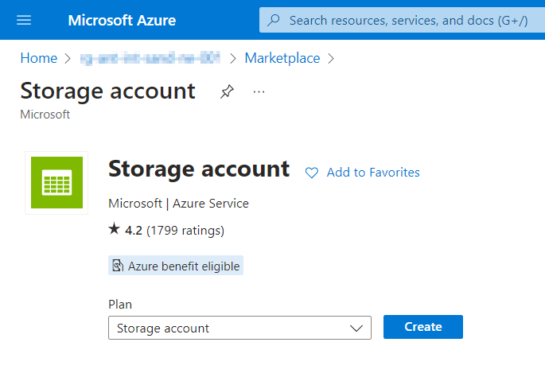
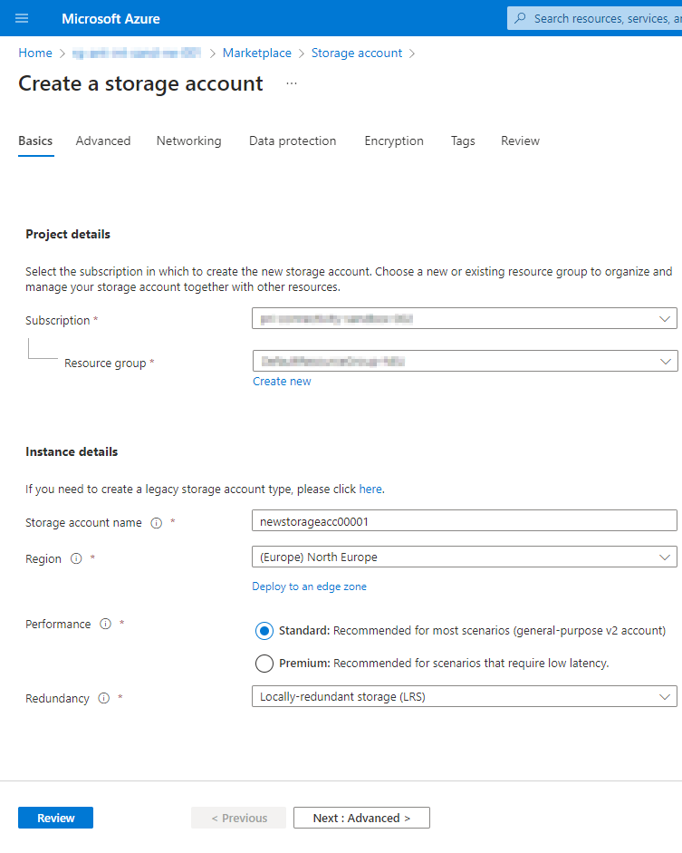
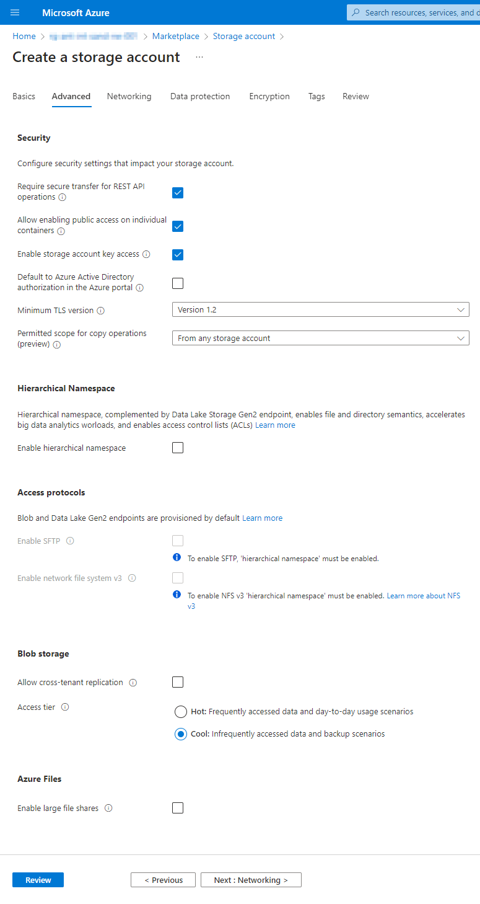
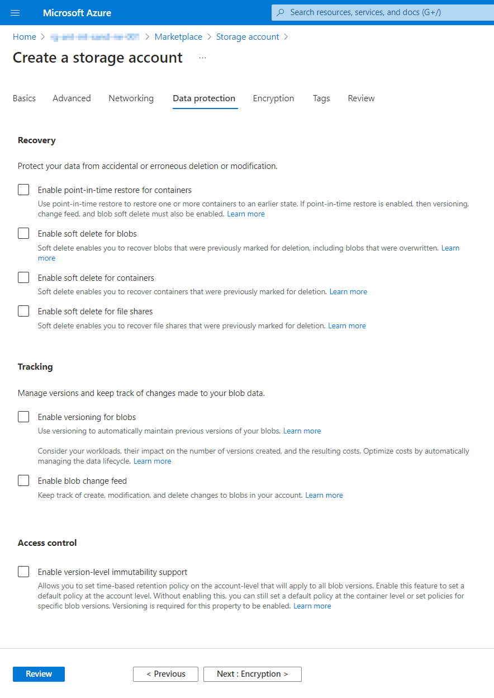
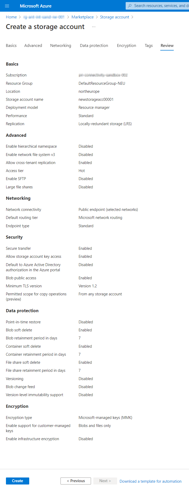

# Create Storage Account in Portal

### Use resource creation tool form any place in portal and select type: Storage Account

### Base attributes

 - Resource Group (prefilled if creation started from existing group)
 - Name (unique per tenant, alpha-numerics)
 - Region (use closest or subscription defined)
 - Redundancy (LRS is preferred for simple cases)

### Advanced attributes
Mostly those attributes can be left alone on defaults
For simple cases to decrease pricing use "cool" access-tier without cross tenant replication

### Networking, DataProtection and Encryption
Those sections also can be passed on-defaults in most cases
Use public-access for simplicity of network configuration

Most data protection attributes can be switched off to save costs if it's not a production environment

If you are not planning to use external encryption key generation, use default options

### Review
Show all previously selected options and attributes

