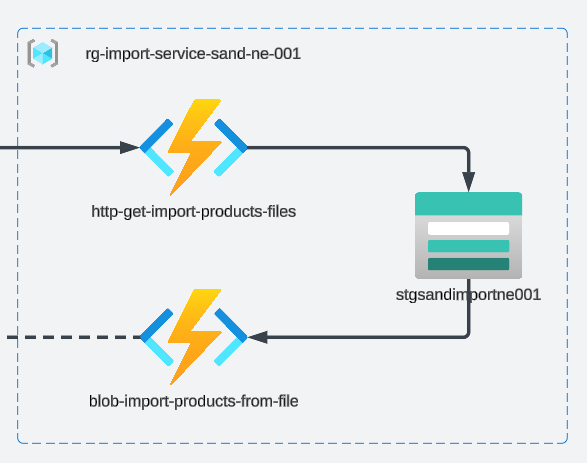

# Tasks

## Focus of Task

---

## Task 5.1

1. Create a new Function App called `import-service` aat the same level as `product-service` with its own
functions configuration.
2. Create a Separate Function App for the Function, as well as storage account that will hold the files.

## Task 5.2

1. Create a function `http-get-import-products-files` with URL `/import`, that accepts query parameter `name` for the file name.
2. The function should return a `SAS` token that allows the FE to upload the file to the storage account.

## Task 5.3

1. Create a function `blob-import-products-from-file` which will be triggered by Storage Account.
2. Configure the Function to trigger only to files uploaded to `uploaded` container in the Storage Account.
3. Implement the business logic that will read the file and parse the CSV file and log each record.

## Task 5.4

1. Commit all your work to separate branch (e.g. `task-5` from the latest `master`) in BE (backend) and if needed in FE (frontend) repositories.
2. Create a pull request to the `master` branch.
3. Submit the link to the pull request for crosscheck

# Evaluation Criteria (70 points for covering all criteria)
------
Reviewers should verify the functions by invoking them through provided URLs.

- Task 5.1 is implemented and the terraform file contains configuration for the function app and storage account.
- Task 5.2 is implemented and function is returning SAS token
- Task 5.3 is implemented and the configuration for blob trigger is present
- Your own Frontend application is integrated with Import Service. Link to a working Frontend application is provided for cross-check reviewer.

## Optional Tasks

- **+15** - The functions are covered with unit tests
- **+15** - At the end of the parsing the file the `blob-import-products-from-file` function should move the file to `parsed` folder.
  (mve the file means that file should be copied into a container `parsed`, and then deleted from `uploaded` container)

# Description Template for PRs
---
:::note
This should be present in the PR\s description!
:::

1. What was done?
2. Link to Product Service and Import Service API.
3. Link to FE PR (Your own repository).
4. In case Swagger file is not provided - please provide product schema in PR description

