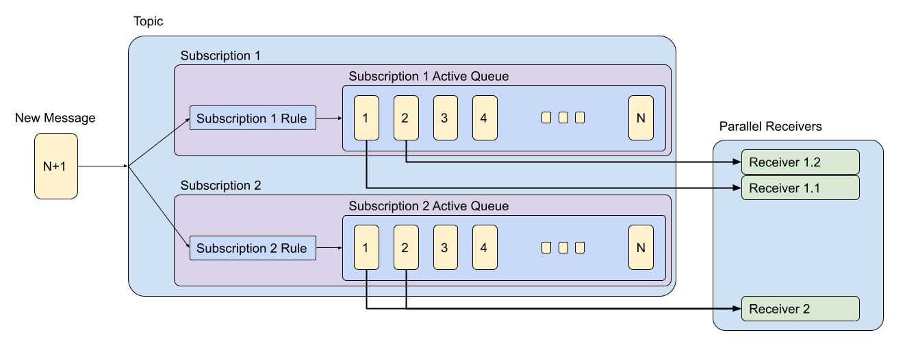

# General Overview

Azure Service Bus (SB) is a managed enterprise message broker. 
It is used to decouple applications and services from each other.

Key benefits:
1. Load-balancing work across competing workers
2. Safety of data routing and transferring
3. Reliability of messaging using transactions

SB Data is transferred using messages. 
A message is a container with metadata and payload data. 
The data can be any kind of information, including common formats: JSON, XML, Apache Avro, Plain Text, etc.

Common messaging scenarios:
1. Messaging: transfer business data.
2. Decouple applications: the load is leveled such that traffic spikes don't overtax a service.
3. Load balancing: allow for multiple competing consumers to read from a queue at the same time.
4. Topics and subscriptions: enable 1:n relationships between publishers and subscribers, allowing subscribers to select particular messages from a published message stream.
5. Transactions: obtain a message from one queue, post results of processing to one or more different queues, move the input message from the original queue.
6. Message sessions: implement high-scale coordination of workflows and multiplexed transfers that require strict message ordering or message deferral.

## Service Bus tiers

**Premium Tier** 
Recommended for production scenarios: 
- High throughput
- Predictable performance
- Fixed Pricing
- Ability to scale workload up and down
- Large message support

**Standard Tier** 
Recommended for message based applications in a pay as you go model with variable throughputs and latencies:
- Variable throughput
- Variable latency
- Pay as you go pricing
- Limited workload scaling
- Message size upto 256KB

## Service Bus related resources

1. Servicebus Namespace (base or root entity for all other resources)
2. Servicebus Authorization Rule
3. Servicebus Disaster Recovery Config
4. Servicebus Network Rule Set
5. Servicebus Queue
6. Servicebus Queue Authorization Rule
7. Servicebus Topic
8. Servicebus Topic Authorization Rule
9. Servicebus Topic Subscription
10. Servicebus Topic Subscription Rule (Filter)

## Service Bus Queues

Queues store messages until the receiving application is available to receive and process them.
Messages in queues are ordered and timestamped on arrival. Once the broker accepts the message, the message is always held durably in triple-redundant storage, spread across availability zones if the namespace is zone-enabled. Service Bus keeps messages in memory or volatile storage until they've been reported by the client as accepted.
Messages are delivered in pull mode, only delivering messages when requested. Unlike the busy-polling model of some other cloud queues, the pull operation can be long-lived and only complete once a message is available.

## Service Bus Topics

Topics are useful in publish/subscribe scenarios.
A subscriber to a topic can receive a copy of each message sent to that topic.
Subscriptions are named entities.
Subscriptions are durable by default, but can be configured to expire and then be automatically deleted.
Via the Java Message Service (JMS) API, Service Bus Premium also allows you to create volatile subscriptions that exist for the duration of the connection.
Subscription rule has a filter to define a condition for the message to be copied into the subscription and an optional action that can modify message metadata.

Subscription Rules scenarios:
1. You don't want a subscription to receive all messages sent to a topic.
2. You want to mark up messages with extra metadata when they pass through a subscription.

## Service Bus Scaling
Scaling applies to only the premium tier and allows to add resources to handle increases in load and also save costs by removing resources that are idle.
Service Bus Premium Messaging provides resource isolation at the CPU and memory level so that each customer workload runs in isolation. 
This resource container is called a messaging unit.
For more details please refer [autoscaling tutorial](https://learn.microsoft.com/en-us/azure/service-bus-messaging/automate-update-messaging-units).
Typical scaling scenarios for Service Bus namespaces:
- Correlate messaging units with increase resource usage (CPU, Memory, etc.);
- Correlate messaging units with expected high-load and low-load hours.

## Service Bus dead-letter queue
The purpose of the dead-letter queue is to hold messages that can't be delivered to any receiver, or messages that couldn't be processed. 
Messages can then be removed from the DLQ and inspected.
From an API and protocol perspective, the DLQ is mostly similar to any other queue, except that messages can only be submitted via the dead-letter operation of the parent entity. 
In addition, time-to-live isn't observed, and you can't dead-letter a message from a DLQ. 
The dead-letter queue fully supports peek-lock delivery and transactional operations.
There's no automatic cleanup of the DLQ. Messages remain in the DLQ until you explicitly retrieve them from the DLQ and complete the dead-letter message.

| Dead-letter reason	         | Dead-letter error description                                                    |
|-----------------------------|----------------------------------------------------------------------------------|
| HeaderSizeExceeded          | Size exceeding in header section                                                 |
| TTLExpiredException         | Expiration of TTL Period                                                         |
| Session ID is null          | Session id should be filled for Session enabled mode                             |
| MaxTransferHopCountExceeded | Number of forwards exceeded. The deafult value is 4                              |
| MaxDeliveryCountExceeded    | Couldn't successfully deliver message to handler in specified number of attempts |

For mode details, please refer [official docs](https://learn.microsoft.com/en-us/azure/service-bus-messaging/service-bus-dead-letter-queues).

## Service Bus OOB Integrations
Service Bus has pre-provided integrates with:
1. [Event Grid](https://learn.microsoft.com/en-us/azure/service-bus-messaging/service-bus-to-event-grid-integration-example)
2. [Logic Apps](https://learn.microsoft.com/en-us/azure/connectors/connectors-create-api-servicebus?tabs=consumption)
3. [Azure Functions](https://learn.microsoft.com/en-us/azure/azure-functions/functions-bindings-service-bus?pivots=programming-language-javascript&tabs=in-process%2Cextensionv5%2Cextensionv3)
4. [Power Platform](https://learn.microsoft.com/en-us/azure/connectors/connectors-create-api-servicebus?tabs=consumption)
5. [Dynamics 365](https://learn.microsoft.com/en-us/dynamics365/fin-ops-core/dev-itpro/business-events/how-to/how-to-servicebus)
6. [Azure Stream Analytics](https://learn.microsoft.com/en-us/azure/stream-analytics/stream-analytics-define-outputs)

## Service Bus standardization 
The primary wire protocol for Service Bus is Advanced Messaging Queueing Protocol (AMQP) 1.0, an open ISO/IEC standard. 
It allows customers to write applications that work against Service Bus and on-premises brokers such as ActiveMQ or RabbitMQ.
Service Bus Premium is fully compliant with the Java/Jakarta EE Java Message Service (JMS) 2.0 API. 
Service Bus Standard supports the JMS 1.1 subset focused on queues.

## Service Bus with a Managed Identity
To use Service Bus triggers with identity-based connections, you will need to add the Azure Service Bus Data Receiver role assignment to the managed identity in your function app. 
This role is required when using managed identities to trigger off of your service bus namespace. 
You can also add your own account to this role, which makes it possible to connect to the service bus namespace during local testing.
 

Role requirements for using identity-based connections vary depending on the service and how you are connecting to it. 
Needs vary across triggers, input bindings, and output bindings. 
For more details on specific role requirements, please refer to the trigger and binding documentation for the service.

### Example of configuring roles for Service Bus in portal:
1. Select Access Control (IAM) is Service Bus.
2. Click Add and select add role assignment.
3. Search for Azure Service Bus Data Receiver, select it, and click Next.
4. On the Members tab, under Assign access to, choose Managed Identity.
5. Click Select members to open the Select managed identities panel.
6. In the Managed identity selector, choose Function App from the System-assigned managed identity category. The label "Function App" may have a number in parentheses next to it, indicating the number of apps in the subscription with system-assigned identities.
7. Your app should appear in a list below the input fields. If you don't see it, you can use the Select box to filter the results with your app's name.
8. Click on your application. It should move down into the Selected members section. Click Select.
9. Back on the Add role assignment screen, click Review + assign. Review the configuration, and then click Review + assign.
10. You've granted your function app access to the service bus namespace using managed identities.

### Example of connecting APP to Service Bus using manged identity in portal:
1. In the portal, search for desired app.
2. In app, select Configuration under Settings.
3. In Application settings, select + New application setting to create the new setting:
 Name: ServiceBusConnection__fullyQualifiedNamespace
 Value: {SERVICE_BUS_NAMESPACE}.servicebus.windows.net
4. After you create the two settings, select Save > Confirm.

When using Azure App Configuration or Key Vault to provide settings for Managed Identity connections, setting names should use a valid key separator such as : or / in place of the __ to ensure names are resolved correctly.
For example, ServiceBusConnection:fullyQualifiedNamespace.
