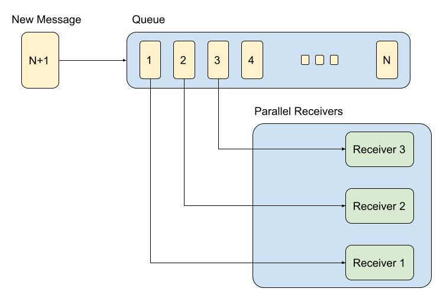
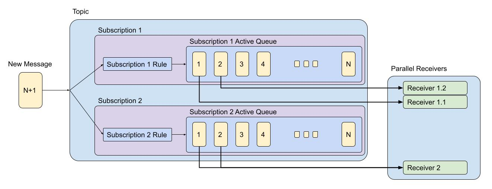

# General Overview

Azure Service Bus (SB) is a managed enterprise message broker. 
It is used to decouple applications and services from each other.

Key benefits:
1. Load-balancing work across competing workers
2. Safety of data routing and transferring
3. Reliability of messaging using transactions

SB Data is transferred using messages. 
A message is a container with metadata and payload data. 
The data can be any kind of information, including common formats: JSON, XML, Apache Avro, Plain Text, etc.

Common messaging scenarios:
1. Messaging: transfer business data.
2. Decouple applications: the load is leveled such that traffic spikes don't overtax a service.
3. Load balancing: allow for multiple competing consumers to read from a queue at the same time.
4. Topics and subscriptions: enable 1:n relationships between publishers and subscribers, allowing subscribers to select particular messages from a published message stream.
5. Transactions: obtain a message from one queue, post results of processing to one or more different queues, move the input message from the original queue.
6. Message sessions: implement high-scale coordination of workflows and multiplexed transfers that require strict message ordering or message deferral.

## Service Bus related resources

1. Servicebus Namespace (base or root entity for all other resources)
2. Servicebus Authorization Rule
3. Servicebus Disaster Recovery Config
4. Servicebus Network Rule Set
5. Servicebus Queue
6. Servicebus Queue Authorization Rule
7. Servicebus Topic
8. Servicebus Topic Authorization Rule
9. Servicebus Topic Subscription
10. Servicebus Topic Subscription Rule (Filter)

## Service Bus Queues

Queues store messages until the receiving application is available to receive and process them.
Messages in queues are ordered and timestamped on arrival. Once the broker accepts the message, the message is always held durably in triple-redundant storage, spread across availability zones if the namespace is zone-enabled. Service Bus keeps messages in memory or volatile storage until they've been reported by the client as accepted.
Messages are delivered in pull mode, only delivering messages when requested. Unlike the busy-polling model of some other cloud queues, the pull operation can be long-lived and only complete once a message is available.

## Service Bus Topics

Topics are useful in publish/subscribe scenarios.
A subscriber to a topic can receive a copy of each message sent to that topic.
Subscriptions are named entities.
Subscriptions are durable by default, but can be configured to expire and then be automatically deleted.
Via the Java Message Service (JMS) API, Service Bus Premium also allows you to create volatile subscriptions that exist for the duration of the connection.
Subscription rule has a filter to define a condition for the message to be copied into the subscription and an optional action that can modify message metadata.

Subscription Rules scenarios:
1. You don't want a subscription to receive all messages sent to a topic.
2. You want to mark up messages with extra metadata when they pass through a subscription.

## Service Bus OOB Integrations
Service Bus has pre-provided integrates with:
1. [Event Grid](https://learn.microsoft.com/en-us/azure/service-bus-messaging/service-bus-to-event-grid-integration-example)
2. [Logic Apps](https://learn.microsoft.com/en-us/azure/connectors/connectors-create-api-servicebus?tabs=consumption)
3. [Azure Functions](https://learn.microsoft.com/en-us/azure/azure-functions/functions-bindings-service-bus?pivots=programming-language-javascript&tabs=in-process%2Cextensionv5%2Cextensionv3)
4. [Power Platform](https://learn.microsoft.com/en-us/azure/connectors/connectors-create-api-servicebus?tabs=consumption)
5. [Dynamics 365](https://learn.microsoft.com/en-us/dynamics365/fin-ops-core/dev-itpro/business-events/how-to/how-to-servicebus)
6. [Azure Stream Analytics](https://learn.microsoft.com/en-us/azure/stream-analytics/stream-analytics-define-outputs)

## Service Bus standardization 
The primary wire protocol for Service Bus is Advanced Messaging Queueing Protocol (AMQP) 1.0, an open ISO/IEC standard. 
It allows customers to write applications that work against Service Bus and on-premises brokers such as ActiveMQ or RabbitMQ.
Service Bus Premium is fully compliant with the Java/Jakarta EE Java Message Service (JMS) 2.0 API. 
Service Bus Standard supports the JMS 1.1 subset focused on queues.
