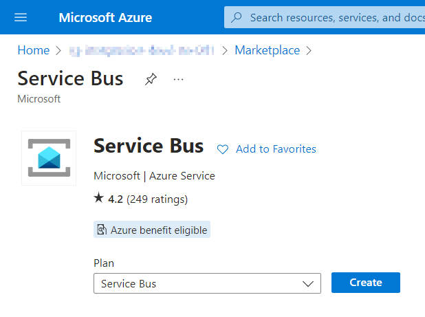

# Create Service Bus in Portal

### Use resource creation tool form any place in portal and select type: Storage Account

### Base attributes

- Resource Group (prefilled if creation started from existing group)
- Name (unique per tenant, alpha-numerics)
- Location (use closest or subscription defined)
- Pricing ("Basic" for our example)

### Advanced attributes

- Minimum TLS Version (use default)
- Local Authentication (should be enabled to be able to integrate other services via access-key)

### Networking
Use public access to minimize configuration efforts for vnet/subnet part
For production cases, please use private access paired with private endpoints configuration

### Review
Show all previously selected options and attributes

# Create Service Bus using Terraform

### Create Resource Group
<pre>
/* Docs: https://registry.terraform.io/providers/hashicorp/azurerm/latest/docs/resources/resource_group */
resource "azurerm_resource_group" "rg" {
  name     = "my-ressource-group"
  location = "West Europe"
}
</pre>

### Create Service Bus Namespace
<pre>
/* Docs: https://registry.terraform.io/providers/hashicorp/azurerm/latest/docs/resources/servicebus_namespace.html */
resource "azurerm_servicebus_namespace" "sb" {
  name                          = "my-new-servicebus"
  location                      = azurerm_resource_group.rg.location
  resource_group_name           = azurerm_resource_group.rg.name
  sku                           = "Basic"
  capacity                      = 0 /* standard for sku plan */
  public_network_access_enabled = true /* can be changed to false for premium */
  minimum_tls_version           = "1.2"
  zone_redundant                = false /* can be changed to true for premium */
}
</pre>

### Create Service Bus Queue
<pre>
/* Docs: https://registry.terraform.io/providers/hashicorp/azurerm/latest/docs/resources/servicebus_queue */
resource "azurerm_servicebus_queue" "example" {
  name                                    = "my_new_servicebus_queue"
  namespace_id                            = azurerm_servicebus_namespace.sb.id
  status                                  = "Active" /* Default value */
  enable_partitioning                     = true /* Default value */
  lock_duration                           = "PT1M" /* ISO 8601 timespan duration, 5 min is max */
  max_message_size_in_kilobytes           = 256 /* default for Basic tier */
  max_size_in_megabytes                   = 1024 /* Default value */
  max_delivery_count                      = 10 /* Default value */
  requires_duplicate_detection            = false
  duplicate_detection_history_time_window = "PT10M" /* ISO 8601 timespan duration, 5 min is max */
  requires_session                        = false
  dead_lettering_on_message_expiration    = false
}
</pre>
