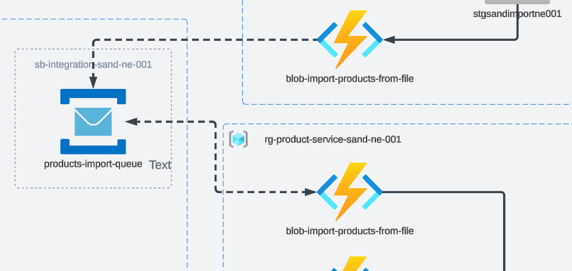

# Tasks

## Focus of Task

- The task is continuation of Task #5;
- The goal is to create a service to be able to save products which were provided in csv file to the Cosmos DB.

---

## Task 6.1
1. Create a service-bus and create a queue. 
2. In the `products-service` create a function `service-bus-import-product` that will be triggered by a service-bus.
3. The function should insert each product into the Cosmos DB.

## Task 6.2
1. Update the `blob-import-products-from-file` to push the products to the service-bus topic created previously.
2. Remove the logs that included each product.

## Task 6.3

1. Commit all your work to separate branch (e.g. `task-6` from the latest `master`) in BE (backend) and if needed in FE (frontend) repositories.
2. Create a pull request to the `master` branch.
3. Submit the link to the pull request for crosscheck

# Evaluation Criteria (70 points for covering all criteria)
------
Reviewers should verify the functions by invoking them through provided URLs.

- Task 6.1 is implemented and the terraform files contain the configuration for service bus, the function to upsert products to Cosmos DB is implemented.
- Task 6.2 is implemented and function pushes the products to the Service Bus

## Optional Tasks

- **+10** - The functions are covered with unit tests
- **+20** - Service Bus Topic with multiple subscriptions is used. A subscription has a filter by property.

# Description Template for PRs
---
:::note
This should be present in the PR\s description!
:::

1. What was done?
2. Link to Product Service and Import Service API.
3. Link to FE PR (Your own repository).
4. In case Swagger file is not provided - please provide product schema in PR description

