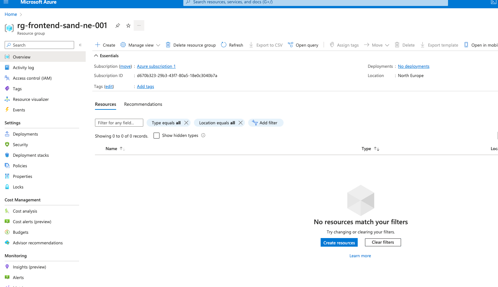

# Setting up terraform

We will be using Terraform a lot in this program to provision cloud resources, so lets set-up the terraform for local usage.

1. Install the terraform following the guidelines from https://developer.hashicorp.com/terraform/tutorials/azure-get-started/install-cli
2. Install the Azure CLI and create service principle to set-up local env following the steps in https://developer.hashicorp.com/terraform/tutorials/azure-get-started/azure-build

Now you are ready to create your first resource, for that let's create a resource group.

```terraform
    resource "azurerm_resource_group" "front_end_rg" {
        name     = "rg-frontend-sand-ne-001"
        location = "northeurope"
    }
```

Run `terraform apply` and confirm that you can see the group created in the Azure Portal!



Congrats you have created your first resource in Azure! 

To find out about Resource Groups read more in https://learn.microsoft.com/en-us/azure/azure-resource-manager/management/manage-resource-groups-portal

In case you stuck with some terraform configuration for this course you can look up the example of implementation in https://github.com/EPAM-JS-Competency-center/shop-nodejs-azure-serverless

## Conventions and best practices

It is better to follow specific conventions when naming your resources in the Cloud.

For examples - `{resource-name}-{service-name}-{region}-{denominator}`

Come up with a short `resource-name` for each type of resource you are using, for example for Function Apps you can use `fa-` prefix.

`service-name` is used to show which specific service is using this resource. `region` is used to show which region this resource belongs to, in our case it is North Europe.

While `denominator` is used in case you need to create more than one resource with the same name, can be useful during upgrades or migrations.
