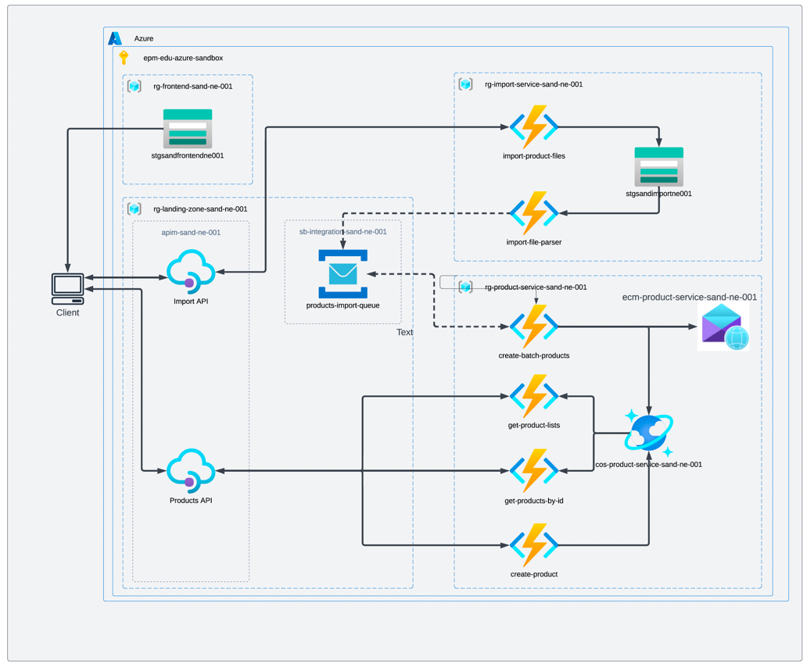

# 00. Azure Cloud Practitioner

Welcome to **Azure Cloud Practitioner Program**!

In this program you are gonna lear the basics of Azure Cloud and get hands-on experience with the Azure!

Azure is gaining more and more popularity among the clients, so learning Azure will be great move to stay on track.

## Program Scope

By the end of this program you will build application depicted in the picture below.

While building the application you will learn how to:
- Host an SPA application in Azure;
- How to build a Serverless Rest API in Azure;
- How to use Serverless Database in Azure;
- How to use Service Bus message broker in Azure;

## Program Principles

The program build as "interactive book" and follows the following principles:
- Text content over videos. We prefer to provide readable content to avoid accent problems etc.
- Reference over duplication. We provide short summary and prefer to provide a link to a documentation rather than copy-writing the same things twice.
- Practice over theory. We focus more on practical tasks rather than providing exhausting theoretical foundation.

## How to work with this program

Each section/module consists of:
- Reading list. A selected list of documentation and articles that you need to read to have a better understanding on the topic.
- Recommendations and crux. Sections that provide summaries and teach you how to assemble different pieces together and how to build systems.
- Practical task. A practical task that you need to implement as your assignment (usually referred as home task).

## Example of solution
In case you stuck with implementation and need to look up how to do something, feel free to use [this example of solution](https://github.com/EPAM-JS-Competency-center/shop-nodejs-azure-serverless).
