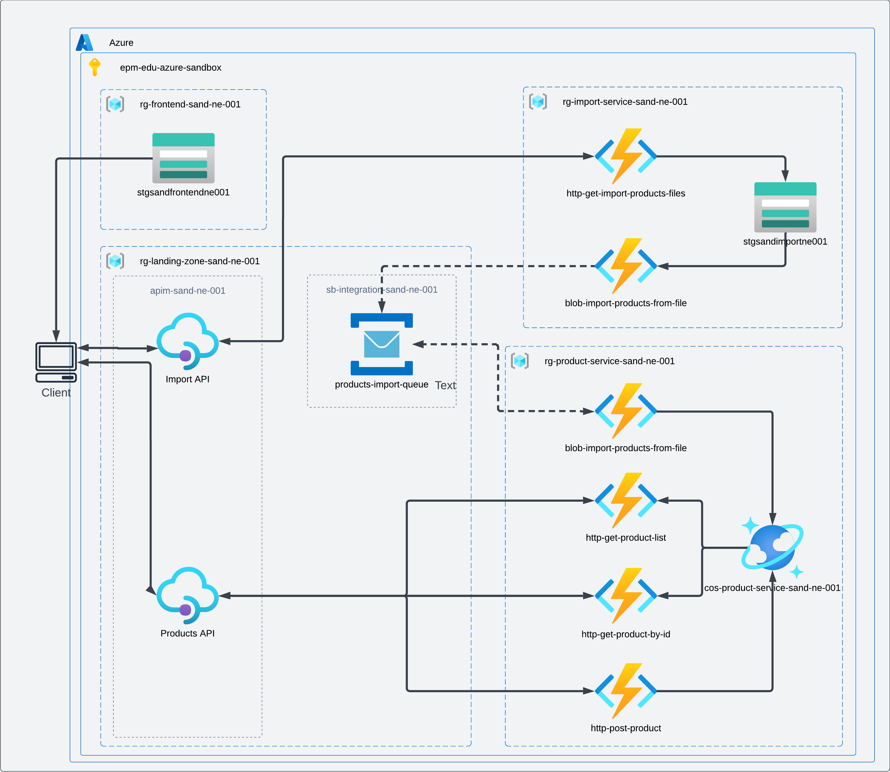

# Azure Cloud Practitioner

Welcome to Azure Cloud Practitioner Program!

In this program you are gonna lear the basics of Azure Cloud and get hands-on experience with the Azure!

Azure is gaining more and more popularity among the clients, so learning Azure will be great move to stay on track.

## Program Scope

By the end of this program you will build application depicted in the picture below.

While building the application you will learn how to:
- Host an SPA application in Azure;
- How to build a Serverless Rest API in Azure;
- How to use Serverless Database in Azure;
- How to use Service Bus message broker in Azure;

So let's jump together in the world of Azure!
